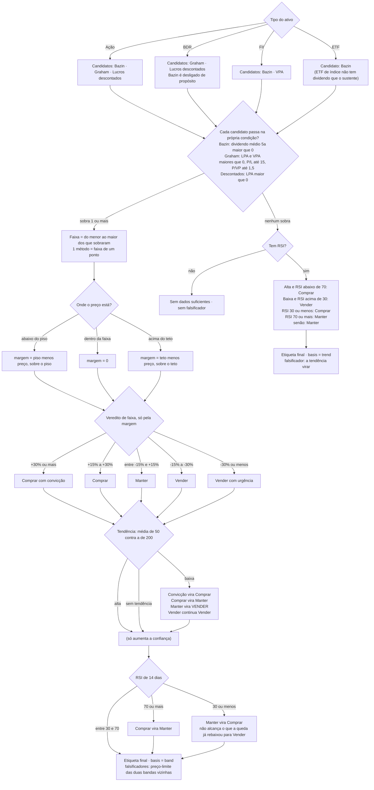

# Cálculos

Cada número que o produto afirma, com entrada, fórmula, saída e **limitação**.
O **código é a fonte de verdade**; este documento é o espelho auditado, com âncora em cada fórmula.
Última revisão: 2026-09-13 · Auditoria completa do motor em 2026-09-13

Se uma fórmula aqui divergir do código, o código está certo e este documento tem um bug.

---

## Preço justo

### Métodos

| Método | Fórmula | Aplicado a | Âncora |
|---|---|---|---|
| **Bazin** | `dividendo médio 5a ÷ yield desejado` | ações, FIIs, ETFs | `analysis/fair_price.py:157` |
| **Graham** | `√(22,5 × LPA × VPA)`, **só com P/L ≤ 15 e P/VP ≤ 1,5** | ações, BDRs | `analysis/fair_price.py` |
| **Lucros descontados** | LPA projetado 5 anos, desconto 13%, P/L terminal 15 | ações, BDRs | `analysis/fair_price.py:184` |
| **VPA** | valor patrimonial por cota | FIIs | `analysis/fair_price.py:258` |

### A faixa, por classe de ativo

| Classe | Métodos que entram na faixa |
|---|---|
| Ação | Bazin + Graham + lucros descontados |
| FII | Bazin + VPA |
| BDR | Graham + lucros descontados (Bazin desligado) |
| ETF | **nenhum** — ver "Quando não há método" |

```
piso = o mais conservador dos métodos que se aplicam
teto = o mais otimista
```

**Não há média.** Os métodos não medem a mesma coisa — Bazin mede dividendo, Graham mede lucro e
patrimônio, os lucros descontados medem crescimento —, e a média de estimadores incompatíveis é um
número que nenhum deles sustenta. Ver [ADR-011](decisoes/ADR-011-preco-justo-e-faixa.md).

Cada método só entra quando as próprias condições se sustentam: **Graham se abstém fora de
P/L ≤ 15 e P/VP ≤ 1,5**, e Bazin exige dividendo médio positivo.

`consensus_methods` viaja até a tela, porque faixa de um método é um ponto — e a interface é
obrigada a dizer quantos métodos a sustentam. `consensus` continua na resposta como média dos
métodos, sem decidir nada.

### Quando os métodos discordam

`method_dispersion` (`teto ÷ piso`) continua sendo calculado e, acima de `MAX_METHOD_DISPERSION`,
marca `methods_disagree`. Isso **não cala mais o veredito**: a discordância é a largura da faixa, e
uma faixa larga leva o preço a cair dentro dela, onde a leitura é "não há margem a favor nem contra".

Até 2026-09-19 a discordância produzia abstenção (`UNKNOWN`). Medida em produção naquele dia, ela
deixava **11 de 22 ações sem veredito nenhum**.

### Quando não há método

Para ETF de índice não há LPA, VPA nem dividendo que sustente qualquer método: não há faixa, e
`margin_of_safety` é `None` — nunca um número contra um preço justo inexistente.

Nesse caso a leitura vem da **tendência** (médias móveis e RSI) e se declara: `decision.basis` sai
`trend` em vez de `band`. A regra vive só em `decide()`, então o Descobrir e a análise dizem o mesmo.
O falsificador é a tendência virar — específico e conferível.

### Margem de segurança

```
preço < piso    →  margem = (piso − preço) ÷ piso      (a favor)
piso ≤ preço ≤ teto  →  margem = 0                     (não há margem)
preço > teto    →  margem = (teto − preço) ÷ teto      (contra)
```

**A margem mede contra a borda, não contra a média.** Comprar exige preço abaixo do método mais
pessimista; ficar caro exige preço acima do mais otimista. `fair_price.py::margin_of_safety_in_band`

### Premissas

| Premissa | Valor | Configurável |
|---|---|---|
| Yield desejado — ações | 6% | ✅ por usuário |
| Yield desejado — FII | 10% | ✅ |
| Yield desejado — BDR / ETF | 4% | ✅ |
| Múltiplo de Graham | 22,5 | ❌ constante |
| Taxa de desconto | 13% ao ano | ❌ igual para toda empresa |
| Crescimento padrão | 8% ao ano, teto 25% | ❌ |
| P/L terminal | 15 | ❌ |
| Janela de dividendos | 5 anos completos | ❌ |

### Proteções

**Outlier de dividendo:** se o yield implícito passar de 30%, troca a média pela **mediana**
(`fair_price.py:250`). Defende contra o provento extraordinário que inflaria o Bazin por cinco anos.

**Anos completos:** a janela usa do ano anterior para trás, não o ano corrente incompleto. Sem dado
no período, cai para os últimos 12 meses.

### Limitações — leia antes de confiar no número

1. **O "DCF" não é um DCF.** Desconta **lucro por ação**, não fluxo de caixa livre, e usa
   crescimento de **receita** como proxy de crescimento de lucro. É um modelo de lucros descontados
   com premissas constantes.
2. **A taxa de desconto é fixa em 13% para qualquer empresa.** Sem beta, sem WACC, sem prêmio de
   risco por setor ou porte.
3. **O múltiplo 22,5 de Graham é de 1949 e do mercado americano.** Não é ajustado à Selic. Em juro
   alto, ele é generoso.
4. **ETF não tem preço justo.** A leitura sai da tendência, e vem marcada como tal.
5. **A faixa não pondera.** Um método frágil define a borda igual a um método firme — o que a
   largura mostra é desacordo, não qualidade.
6. **Bazin pressupõe dividendo estável.** Para empresa cíclica, projeta o passado bom para sempre.
7. **Faixa de um método é um ponto.** Quando só um método se aplica, a leitura volta a depender de
   um número só — a tela declara isso, mas o risco continua.

---

## Score de oportunidade

Nota de 0 a 100 por ativo. `analysis/scoring.py`

### Dimensões

| Dimensão | Fórmula | Satura em | Âncora |
|---|---|---|---|
| Margem de segurança | `50 + margem × 100` | ±50% | `scoring.py:64` |
| Qualidade | média de `ROE × 4` e `margem × 5` | ROE 25%, margem 20% | `scoring.py:12` |
| Dividendos | `DY × 12,5` | DY 8% | `scoring.py:23` |
| Alavancagem | `100 − D/E ÷ 2` | D/E 200% | `scoring.py:29` |
| Crescimento | `(crescimento + 10) × 100/30` | −10% a +20% | `scoring.py:35` |
| Liquidez | `(log₁₀(valor de mercado) − 7) × 30` | ~R$ 20 bi | `scoring.py:41` |
| Técnico | `50 + (60 − RSI) × 0,5`, ±10 por tendência | — | `scoring.py:47` |

Todas as entradas em **percentual**, exceto a margem de segurança, que é fração.

### Pesos — ações e BDRs, por perfil de risco

| Dimensão | Conservador | Moderado | Arrojado |
|---|---|---|---|
| Margem de segurança | 30% | 30% | 20% |
| Qualidade | 20% | 20% | 20% |
| Dividendos | **25%** | 15% | **5%** |
| Alavancagem | 15% | 10% | 5% |
| Crescimento | **5%** | 15% | **40%** |
| Técnico | 5% | 10% | 10% |

`scoring.py:68-93`

### Pesos — FIIs e ETFs

| Classe | Margem | Dividendos | Liquidez |
|---|---|---|---|
| FII | 45% | 40% | 15% |
| ETF | 55% | 30% | 15% |

⚠️ **O perfil de risco não afeta FIIs nem ETFs.** Os pesos são fixos e `profile` não entra no ramo.
Quem tem carteira de FIIs muda de conservador para arrojado e nada acontece. Ver
[10-PROBLEMAS](10-PROBLEMAS.md).

### Normalização por dado faltante

Dimensão sem dado é removida, e o peso é renormalizado sobre o que sobrou:

```
score = Σ(peso × valor) ÷ Σ(pesos disponíveis)
completude = Σ(pesos disponíveis) ÷ Σ(todos os pesos)
```

### O piso de completude

`MIN_DATA_COMPLETENESS = 0.5`, em `analysis/score_ruler.py`. Abaixo do piso, o score existe mas
**não é apresentado como banda**: o cliente mostra a leitura como insuficiente
(`fiScoreBandFor` devolve a banda `insufficient` em `mobile/lib/core/product_rules.dart`).

O corte acontece **na apresentação, não no cálculo**, e isso é deliberado: suprimir entregaria tela
vazia em vez de leitura parcial declarada.

A medição de 2026-09-13 mostrou que, **para ação**, isso quase nunca dispara — os fundamentos chegam
em 80% a 100% dos casos. Onde ele importa é em **FII, BDR e ETF**, cujas dimensões de fundamento são
vazias por natureza da classe: FII perde a liquidez (15% do peso, `market_cap` ausente em 5 de 5) e
BDR perde Graham inteiro (VPA ausente em 4 de 4, e o consenso cai para um método). Ver
[10-PROBLEMAS](10-PROBLEMAS.md), item 3.

`tests/test_regua_nas_duas_plataformas.py` confronta o limiar do Python com o do Dart. **O Python é
a fonte.**

### Bandas

| Score | Banda |
|---|---|
| ≥ 75 | Excelente entrada |
| ≥ 60 | Boa oportunidade |
| ≥ 40 | Neutro |
| < 40 | Evitar agora |

`analysis/score_ruler.py` — **a fonte é o Python**. O espelho em
`mobile/lib/core/score_ruler.dart` deve mudar depois, nunca antes.

---

## Veredito

Sai da margem de segurança, e depois é **ajustado pela análise técnica**. `analysis/decision.py`

### O veredito de faixa, só pela margem

| Margem | Veredito | Rótulo |
|---|---|---|
| ≥ +30% | `STRONG_BUY` | Comprar com convicção |
| ≥ +15% | `BUY` | Comprar |
| entre −15% e +15% | `HOLD` | Manter |
| ≤ −15% | `SELL` | Vender |
| ≤ −30% | `STRONG_SELL` | Vender com urgência |
| sem faixa e sem tendência | `UNKNOWN` | Sem dados suficientes |

Este é o `band_verdict`, e é ele que os falsificadores de preço leem ao contrário.

### O caminho inteiro, do tipo do ativo à etiqueta



### O que o desenho torna visível

**O nó `Manter vira VENDER` decide a maior parte da base.** Com a faixa, muito mais ativo cai em
`HOLD` — é o que "dentro da faixa" significa —, e toda tendência de baixa o converte em venda.
Medido em produção em **2026-09-20**, logo após a faixa subir: **11 de 22 ações** da amostra saem
com sinal de venda, e seis delas com margem **zero ou positiva** (TOTS3, RENT3, VALE3, ITUB4,
BBDC4, LREN3).

**O resgate pelo RSI chega tarde.** `RSI ≤ 30 → HOLD vira BUY` roda depois do ajuste de tendência,
então o ativo sobrevendido que a queda já rebaixou para `SELL` nunca é recuperado — ele deixou de
ser `HOLD` antes da regra rodar.

**A tendência de alta não promove ninguém**, só aumenta a confiança. A assimetria é deliberada no
código e **nunca foi decidida por escrito**.

**Consequência que precisa estar escrita:** o veredito herda integralmente a fragilidade do preço
justo. Toda limitação da seção anterior é também limitação do veredito — e, pelo que o desenho
mostra, também a da análise técnica.

---

## Falsificadores

O que derrubaria o veredito, em condição conferível. `analysis/falsifiers.py`

Os limiares de margem dão, por álgebra, o preço em que o veredito muda — e a borda usada é a mesma
que a margem mede:

```
margem ≥ 0  →  preço_alvo = piso × (1 − margem_da_banda)
margem < 0  →  preço_alvo = teto × (1 − margem_da_banda)
```

Produz até dois falsificadores de preço — a banda acima e a banda abaixo — e um de dividendo, que só
sai quando **é o dividendo que sustenta a tese**: Bazin no piso da faixa e preço abaixo dele. Aí ele
calcula o corte que levaria a margem até a borda da compra.

**Sem faixa, não há preço-limite.** Para leitura de tendência (`basis: trend`), o que sai é a
reversão da tendência e o RSI, que são conferíveis. Sem faixa **e** sem tendência, a lista sai vazia:
não há falsificador genérico — "fique de olho nos resultados" seria almanaque no lugar de uma
condição conferível.

---

## Análise de quedas

`analysis/dip_analysis.py` — pontuação de 100 para diagnosticar uma queda.

| Dimensão | Peso |
|---|---|
| Valor (margem de segurança) | 30 |
| Qualidade | 25 |
| Técnico | 25 |
| Dividendos | 10 |
| Notícias | 10 |

Responde "esta queda é oportunidade ou deterioração?". Estado `[IMPLEMENTADO]`.

---

## Saúde da carteira

`analysis/portfolio_health.py` — pontuação ponderada sobre diversificação, concentração e qualidade
das posições.

---

## Projeção de patrimônio

`analysis/scenarios.py` — **três cenários, sempre**. Nunca um número único.

| Cenário | Fator | Racional |
|---|---|---|
| Conservador | 0,0 | A carteira não valoriza e os dividendos não crescem. Só o aporte trabalha. **É o único que não depende de previsão** |
| Base | 1,0 | As premissas informadas, aplicadas mês a mês |
| Otimista | 1,5 | As mesmas premissas multiplicadas por 1,5 |

O fator otimista de 1,5 **não é uma estimativa: é a largura escolhida para a faixa**, e o código diz
isso ao usuário com essas palavras.

`_low` e `_high` são campos **obrigatórios** de `PassiveIncomeMonth`: com default, existiria caminho
em que o número sai sozinho. `test/lint_ui_test.dart` recusa tela que exiba patrimônio ou renda
passiva projetados sem a faixa.

> Projeção não é previsão. A faixa mostra três contas com premissas diferentes, não a probabilidade
> de cada uma acontecer.

---

## Apuração de imposto

`ledger/apuracao.py` — projeção do razão, com o mês como unidade.

### Alíquotas

| Categoria | Alíquota | Isenção |
|---|---|---|
| `acoes_br` | 15% | R$ 20.000 em vendas no mês |
| `bdrs`, `etfs` | 15% | ❌ |
| `fiis` | 20% | ❌ |

### Ordem do cálculo, por mês e categoria

1. Soma as vendas do mês e o resultado (`valor bruto − custo − taxas`)
2. Verifica a isenção — **só para `acoes_br`**, sobre o **volume vendido**, não sobre o lucro
3. Se isento e com lucro: sem imposto
4. Se isento e com prejuízo: **o prejuízo não gera crédito compensável**
5. Se tributável: abate prejuízo acumulado da **mesma categoria**
6. Aplica a alíquota sobre o que sobrou

**A isenção corta os dois lados.** É a regra que mais surpreende, e está no passo 4.

### O que não existe

Não há campo de imposto gravado numa venda. Gravá-lo fazia a ordem de registro dentro do mês mudar o
número, a isenção não ser reavaliada, e a venda vinda de `POST /transactions` não apurar nada.

O IR que aparece por linha em Encerradas é **rateio** do mês, e a tela diz isso.

### Limitações

- **Não cobre day trade** (alíquota de 20% e apuração própria)
- **Não emite DARF** — dá o número, não a guia
- Não gera informe para a declaração anual
- Não trata compensação entre categorias diferentes (correto: a lei não permite)

O texto de `/aviso-cvm` declara essas limitações ao usuário.

---

## Caixa: livre agora e sobra

`cashflow/month.py`

```
livre_agora  = entrou − saiu − comprometido            ← FATO
sobra_piso   = livre_agora − gasto_variável_esperado_alto   ← PROJEÇÃO
sobra_teto   = livre_agora − gasto_variável_esperado_baixo  ← PROJEÇÃO
```

**A estimativa sai de até 3 meses fechados da própria pessoa** (`MESES_DE_BASE = 3`), sobre as
categorias variáveis. Sem base, `tem_faixa` é falso e a sobra é o próprio `livre_agora`.

Categorias fora da base: `provento` e `reembolso` não são renda recorrente; `divida` não é consumo.

---

## Régua de dívida

`cashflow/debt.py`

```
classe = CARA          se taxa_mensal > referência
       = ADMINISTRÁVEL se taxa_mensal ≤ referência
       = SEM_TAXA      se a taxa não foi informada
```

**Referência**, em ordem: o retorno mensal da carteira da pessoa → o CDI do BCB → sem referência,
sem classe.

**`taxa_de_virada` = a referência.** É o falsificador: a taxa em que o veredito muda.

**Conversão de taxa anual para mensal é por juros compostos:**

```
mensal = (1 + anual)^(1/12) − 1
```

Dividir por 12 superestima a referência e **afrouxa** a régua — 12% ao ano dariam 1,0% em vez de
0,9489%, e uma dívida a 0,97% ao mês sairia como administrável. O erro cairia do lado de não avisar.

---

## Cascata da sobra

`cashflow/cascata.py` — ordem fixa, cada passo com motivo e falsificador.

**1 · Dívida cara** — enquanto houver saldo classificado como caro, ele vem antes de tudo. O motivo
compara a taxa da dívida com o que a carteira rende, e nomeia a fonte da referência.

**2 · Reserva** — só existe com **alvo declarado em meses do próprio gasto fixo**. O gasto fixo sai
da média dos últimos 3 meses das categorias fixas realizadas. O produto não inventa seis meses.

O alvo em meses é declarado em `preferences.reserve_months_target`, e **nada mais é declarado**: a
base é o gasto fixo do próprio caixa, e a reserva atual é a renda fixa de **liquidez diária** —
papel preso até o vencimento não cobre emergência. Sem alvo, o passo não aparece. Ver
[ADR-012](decisoes/ADR-012-o-alvo-e-de-quem-declara.md).

**3 · Aporte** — o que sobrou. Se houver meta de alocação, a ordem sai pelo desvio; sem meta, pelo
score.

**A cascata pode terminar sem passo de aporte, e isso é sucesso.** Com dívida cara consumindo a
sobra inteira, a resposta certa é não aportar.

---

## Sugestões de rebalanceamento

`analysis/strategy.py` — `build_rebalance_suggestions`

Produz duas listas:

- **comprar**: por lacuna de alocação contra a meta, ordenada por score dentro da categoria
- **reduzir**: posições com veredito `SELL` ou `STRONG_SELL`, com destaque para as de categoria
  acima da meta

Cada sugestão carrega até 3 razões escritas.

Estado `[SEM CLIENTE]`: o cálculo existe e produz a comparação entre o que se tem e o que se quer.
Falta a tela.

---

## Renda fixa

`analysis/renda_fixa_analysis.py` — marcação a mercado por tipo de taxa, com o IPCA do BCB para os
indexados. Compara com o CDI e projeta o valor no vencimento.

A curva de CDI é extrapolada da taxa de hoje (`cdi_basis`), então é **referência, não acumulado
histórico** — e o rótulo de fonte viaja até a tela.

---

## Onde cada limiar vive

| Limiar | Arquivo | Espelho |
|---|---|---|
| Bandas de score | `analysis/score_ruler.py` | `mobile/lib/core/score_ruler.dart` |
| Limiares de veredito | `analysis/decision.py` | `mobile/lib/core/product_rules.dart` |
| Pesos por perfil | `analysis/scoring.py` | — |
| Alíquotas e isenção | `ledger/apuracao.py` | — |

**Mudar um limiar exige as duas plataformas, e o Python é o primeiro.** Réguas divergentes fazem a
tela dizer "boa oportunidade" sobre um número que o servidor classificou como neutro.
