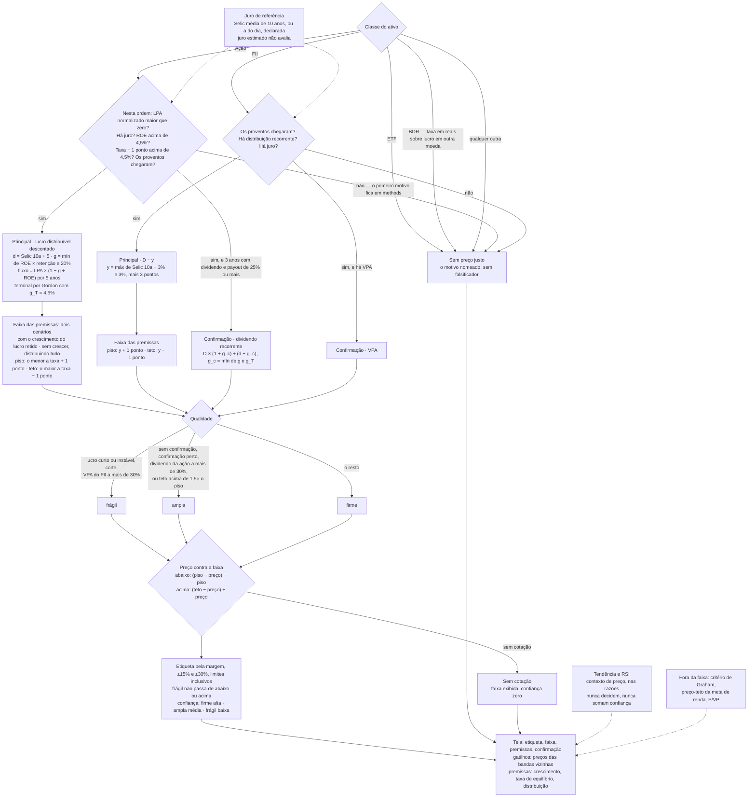

# Cálculos

Cada número que o produto afirma, com entrada, fórmula, saída e **limitação**.
O **código é a fonte de verdade**; este documento é o espelho auditado, com âncora em cada fórmula.
Última revisão: 2026-09-25 · Faixa da ação refeita pela ADR-015; qualidade pela ADR-016

Se uma fórmula aqui divergir do código, o código está certo e este documento tem um bug.

---

## Preço justo

Cada classe tem **um modelo principal**, a faixa é a sensibilidade dele às premissas, e **outro
insumo confirma ou não**. Não há mínimo e máximo de métodos que medem coisas diferentes, nem média
deles. Ver [ADR-014](decisoes/ADR-014-um-modelo-por-classe.md). `analysis/fair_price.py`

### Por classe de ativo

| Classe | Principal | Confirmação | Por quê |
|---|---|---|---|
| Ação | lucro distribuível descontado | dividendo recorrente | o lucro é o que gera valor; o dividendo diz se ele vira caixa |
| FII | distribuição recorrente ÷ yield exigido | VPA | a lei obriga a distribuir 95% do resultado de caixa: a distribuição **é** o fluxo |
| BDR | **nenhum** | — | a única taxa disponível é em reais, e o lucro não é |
| ETF | **nenhum** | — | o preço acompanha o valor do que o fundo carrega |
| Qualquer outra | **nenhum** | — | não há modelo declarado para ela; o modelo de ação só vale para `br_stock` |

### A taxa

```
d_ação = Selic média de 10 anos + 5 pontos
g_T    = meta de inflação (3%) + 1,5% de crescimento real       = 4,5%
y_FII  = máx(Selic média de 10 anos − meta de inflação, 3%) + 3 pontos
```

A Selic média de 10 anos sai da série mensal 4189 do SGS (`collectors/rates.py::_selic_media`).
**Custo de capital é taxa de longo prazo**: a Selic de um dia mudaria todo preço justo a cada Copom,
e a média de dois anos, no pico do ciclo, dava 19% de taxa e quase toda ação acima do preço justo.
Sem a série, entra a Selic do dia, e `premises.rate_base` diz qual base foi usada. As premissas
também carregam a origem da taxa (`rate_source`, que pode ser `bcb_cache_vencido`), a Selic usada
(`selic_pct`), o momento da leitura (`rates_as_of`) e a data de referência da janela de dividendos
(`reference_date`). **Com juros
estimados (`source: estimativa`), não há avaliação** — `analysis/fair_price.py::rates_for_valuation`.
Selic zero, na média e no dia, conta como ausência de juro.

### O modelo de ação

```
V(d, g) = Σ_{t=1..5} LPA_n·(1+g)^t·q ÷ (1+d)^t
        + LPA_n·(1+g)^5·(1+g_T)·(1 − g_T/ROE) ÷ ((d − g_T)·(1+d)^5)

q = 1 − g/ROE          (o que pode ser distribuído sem deixar de crescer)
g = mín(ROE × (1 − payout), 20%)
payout = dividendo recorrente ÷ LPA_n, entre 0 e 1
```

`analysis/fair_price.py::earnings_value` e `_earnings_lens`.

- **Só se desconta o que pode ser distribuído.** Somar o lucro inteiro e ainda crescer por
  reinvestimento contava duas vezes o lucro retido. Em regime estável esta é a mesma equação do P/VP
  justificado, `VPA·(ROE − g) ÷ (d − g)` — banco sai avaliado pelo mesmo modelo.
- **Crescer só cria valor quando o ROE passa da taxa.** Com ROE perto de `d`, o valor quase não muda
  com o payout — é o comportamento correto.
- **O terminal sai da mesma taxa**, por Gordon. O P/L terminal implícito cai quando o juro sobe.
- **LPA normalizado** (`normalized_eps`): média dos 3 últimos exercícios, escalada pela razão entre
  lucros — `LPA × média(lucro anual) ÷ lucro de 12 meses`. Em unit, lucro ÷ número de ações não é o
  LPA da unit. Com menos de 3 exercícios, usa o LPA de 12 meses e a qualidade sai frágil. Com o
  LPA e o lucro-base de sinais opostos, ou lucro-base zero, **não há LPA normalizado**: um dos dois
  está errado, e o principal cala com `sem_dado`.
- **ROE normalizado** (`normalized_roe`): média do lucro sobre média do patrimônio, nos mesmos 3
  exercícios alinhados por data. Sem série, o ROE informado. Patrimônio médio negativo: sem ROE.

### O modelo de FII

```
V = distribuição recorrente ÷ y_FII
```

`analysis/fair_price.py::_dividend_lens`.

### O dividendo recorrente

```
cada ano completo da janela de 5 anos limitado a 2 × a mediana dos outros
média   = média desses anos
último  = máx(último ano completo, últimos 12 meses)
recorrente = mín(média, último)
corte   = último < 50% da média
```

`analysis/fair_price.py::recurring_dividend`. Contínuo — 2,9× e 3,1× a mediana dão o mesmo
resultado. **Pega corte**, que é a armadilha de dividendo. Não apaga uma mudança de política para
cima, como fazia a troca da série inteira pela mediana. Ano sem pagamento dentro da série conta como
zero; sem nenhum ano completo, vale a soma dos últimos 12 meses. O ano civil é o brasileiro
(`core/brt.py`): às 22h de 31 de dezembro, o ano ainda não fechou.

**Provento que não chegou não é provento zero.** Quando a fonte falha e não há cache, nem vencido, a
coleta devolve `None`, e não lista vazia (`collectors/universal.py::fetch_dividends`). O principal
cala com `sem_dado`: sem o histórico, o payout é desconhecido, e tratá-lo como zero poria o
crescimento no máximo. A empresa que de fato não paga chega com lista vazia e cresce pelo ROE.

### A faixa

```
com(d') = V(d', g, q = 1 − g/ROE)                o crescimento que o lucro retido sustenta
sem(d') = V(d', 0, q = 1)                        sem crescer, distribuindo todo o lucro

piso    = mín(com(d + 1 ponto), sem(d + 1 ponto))    FII: D ÷ (y + 1 ponto)
teto    = máx(com(d − 1 ponto), sem(d − 1 ponto))    FII: D ÷ (y − 1 ponto)
central = com(d)                                     FII: D ÷ y
posição = (preço − piso) ÷ (teto − piso), quando o preço está dentro
```

**Sem crescimento é sem retenção**, pela mesma identidade `g = ROE × retenção` do modelo. Até
2026-09-25, o piso zerava o crescimento e mantinha `q = 1 − g/ROE`: retinha sem crescer, e com
payout zero sobrava só o terminal ([ADR-015](decisoes/ADR-015-a-faixa-cobre-os-dois-cenarios.md)).
Quando o ROE não paga a taxa, crescer consome valor e `sem` passa de `com`. Por isso a faixa é o
envelope dos dois cenários, e não um deles em cada ponta. `premises.growth_creates_value` diz qual
é o caso, e a razão avisa quando crescer consome valor. A ordem `piso < central < teto` vale nos dois
regimes: `piso ≤ com(d+1) < com(d) < com(d−1) ≤ teto`.

É **incerteza real sobre o valor** — o que acontece se a premissa mais discutível errar —, e não a
distância entre métodos com alvos diferentes. `consensus` e `dcf` (ação) ou `bazin` (FII) carregam o
valor central; nenhum deles decide sozinho.

### A confirmação

| Classe | Leitura | Não se aplica quando |
|---|---|---|
| Ação | `D × (1 + g_c) ÷ (d − g_c)`, com `g_c = mín(g, g_T)` | menos de 3 anos completos **com pagamento**; payout abaixo de 25% |
| FII | VPA | sem VPA |

A concordância é `dentro` da faixa, `fora_ate_30` ou `fora_mais_30`. **A confirmação não define
borda**: ela entra na qualidade.

A distância da concordância se mede contra a borda atravessada: abaixo do piso, `(piso − v) ÷ piso`;
acima do teto, `(v − teto) ÷ teto`. É convenção diferente da margem, que acima do teto divide pelo
preço. Exatamente 30% ainda é `fora_ate_30`.

### Qualidade

| `band_quality` | Quando |
|---|---|
| `fragil` | lucro de menos de 3 exercícios, ou instável (LPA de 12m fora de metade a dobro do normalizado, ou ano com prejuízo); FII com menos de 3 anos completos com distribuição; corte de distribuição; **no FII**, VPA a mais de 30% da faixa |
| `ampla` | sem confirmação; confirmação fora da faixa por até 30%; **na ação**, dividendo a mais de 30% da faixa; teto acima de 1,5× o piso |
| `firme` | nenhum dos anteriores |
| `sem_faixa` | não há modelo principal |

Na ação, o dividendo longe da faixa **alarga, e não derruba**: a confirmação usa a mesma taxa e um
crescimento tirado do principal, e a distância dela é quase função do payout — abaixo de 45%, longe;
de 60% para cima, dentro. No FII, o VPA é insumo independente, e discordar é evidência
([ADR-016](decisoes/ADR-016-a-confirmacao-da-acao-alarga-e-nao-derruba.md)).

`quality_reasons` diz, em frase, o que a definiu. `independent_inputs` é 1 ou 2: o insumo do
principal e, se houver, o da confirmação.

### Silêncio com motivo

`methods[]` traz cada leitura com `role` — `principal`, `confirmacao`, `indicador`, `inaplicavel` — e
`status`:

| Estado | Significa |
|---|---|
| `ok` | a leitura existe |
| `inaplicavel` | não descreve esta classe de ativo |
| `sem_dado` | o insumo não veio da fonte |
| `lucro_negativo` | o LPA normalizado é negativo — informação, não ausência |
| `roe_insuficiente` | o ROE não passa do crescimento de longo prazo: crescer consome valor |
| `sem_juro` | não há juro de referência real |
| `pouco_distribuido` | o dividendo não mede a capacidade de quem distribui menos de 25% do lucro |
| `taxa_implausivel` | a taxa menos o choque não passa do crescimento de longo prazo |

Na ação, o motor confere **nesta ordem** — LPA, juro, ROE, taxa, proventos — e grava só o primeiro
motivo que falha (`_earnings_lens`). Empresa em prejuízo e sem juro de referência aparece como
`lucro_negativo`.

### Indicadores que não decidem

`indicators[]`, fora da faixa:

| Indicador | O que é |
|---|---|
| `graham` | `√(22,5 × LPA_n × VPA)`: o preço-limite do critério defensivo, com `passes`. Dentro do próprio filtro ele sempre fica acima do preço — por isso não pode ser borda |
| `preco_teto_pessoal` | `dividendo recorrente ÷ yield que a pessoa declarou`. É meta de renda, não preço justo: mudar a meta muda o teto, e não a faixa |
| `pvp` | preço sobre valor patrimonial |

### Margem de segurança

```
preço < piso          →  margem = (piso − preço) ÷ piso       (a favor)
piso ≤ preço ≤ teto   →  margem = 0                          (não há margem)
preço > teto          →  margem = (teto − preço) ÷ preço      (contra)
```

As duas pontas medem a mesma distância em escala logarítmica: +30% e −30% correspondem ao mesmo
afastamento. Contra o teto, a fórmula antiga disparava −30% com 23% de distância e exigia 43% para
+30%. `fair_price.py::margin_of_safety_in_band`

### Premissas

| Premissa | Valor | Configurável |
|---|---|---|
| Base da taxa | Selic média de 10 anos | ❌ |
| Prêmio de ação | 5 pontos | ❌ |
| Meta de inflação | 3% | ❌ |
| Crescimento real de longo prazo | 1,5% | ❌ |
| Teto de crescimento | 20% ao ano | ❌ |
| Anos explícitos | 5 | ❌ |
| Choque de taxa na faixa | ±1 ponto | ❌ |
| Prêmio de FII / piso de juro real | 3 pontos / 3% | ❌ |
| Exercícios do LPA normalizado | 3 | ❌ |
| Limite de ano extraordinário / corte | 2× a mediana dos outros / 50% da média | ❌ |
| Yield da meta pessoal | 6% ação, 10% FII | ✅ por usuário — só no preço-teto |

### Limitações — leia antes de confiar no número

1. **Não é fluxo de caixa livre.** Desconta o lucro distribuível; capex, capital de giro e dívida
   líquida por empresa não existem na fonte.
2. **O prêmio é o mesmo para toda empresa.** Sem beta nem estrutura de capital, diferenciar seria
   inventar.
3. **O ROE do terminal é o normalizado de hoje.** Empresa de ROE muito alto sai generosa no longo
   prazo; a concorrência tende a reduzi-lo.
4. **Os parâmetros não têm calibração empírica.** Validá-los exige fundamento *point-in-time*, que a
   BRAPI não entrega.
5. **FII de papel parece barato.** Ele distribui a correção monetária dos CRIs como rendimento, e
   sem o subtipo do fundo o modelo trata tudo como tijolo.
6. **VPA de FII é laudo, com defasagem.** Em FoF, ele já carrega o desconto dos fundos investidos.
7. **Quem cresce o dividendo com a inflação sai cerca de 9% abaixo do último ano**, pelo mínimo
   entre a média e o mais recente.
8. **Cíclica em ciclo longo** ainda pode ter três exercícios de pico; a normalização suaviza, não
   resolve.
9. **±15% e ±30% são convenção declarada**, não fronteira medida. A mudança de etiqueta é degrau:
   o falsificador de preço mostra a que distância ela está.

---

## Score de oportunidade

Nota de 0 a 100 por ativo. `analysis/scoring.py`

### Dimensões

| Dimensão | Fórmula | Satura em | Âncora |
|---|---|---|---|
| Margem de segurança | `50 + margem × 100` | ±50% | `scoring.py:64` |
| Qualidade | média de `ROE × 4` e `margem × 5` | ROE 25%, margem 20% | `scoring.py:12` |
| Dividendos | `DY × 12,5` | DY 8% | `scoring.py:23` |
| Alavancagem | `100 − D/E ÷ 2` | D/E 200% | `scoring.py:29` |
| Crescimento | `(crescimento + 10) × 100/30` | −10% a +20% | `scoring.py:35` |
| Liquidez | `(log₁₀(valor de mercado) − 7) × 30` | ~R$ 20 bi | `scoring.py:41` |
| Técnico | `50 + (60 − RSI) × 0,5`, ±10 por tendência | — | `scoring.py:47` |

Todas as entradas em **percentual**, exceto a margem de segurança, que é fração.

### Pesos — ações e BDRs, por perfil de risco

| Dimensão | Conservador | Moderado | Arrojado |
|---|---|---|---|
| Margem de segurança | 30% | 30% | 20% |
| Qualidade | 20% | 20% | 20% |
| Dividendos | **25%** | 15% | **5%** |
| Alavancagem | 15% | 10% | 5% |
| Crescimento | **5%** | 15% | **40%** |
| Técnico | 5% | 10% | 10% |

`scoring.py:68-93`

### Pesos — FIIs e ETFs

| Classe | Margem | Dividendos | Liquidez |
|---|---|---|---|
| FII | 45% | 40% | 15% |
| ETF | 55% | 30% | 15% |

⚠️ **O perfil de risco não afeta FIIs nem ETFs.** Os pesos são fixos e `profile` não entra no ramo.
Quem tem carteira de FIIs muda de conservador para arrojado e nada acontece. Ver
[10-PROBLEMAS](10-PROBLEMAS.md).

### Normalização por dado faltante

Dimensão sem dado é removida, e o peso é renormalizado sobre o que sobrou:

```
score = Σ(peso × valor) ÷ Σ(pesos disponíveis)
completude = Σ(pesos disponíveis) ÷ Σ(todos os pesos)
```

### O piso de completude

`MIN_DATA_COMPLETENESS = 0.5`, em `analysis/score_ruler.py`. Abaixo do piso, o score existe mas
**não é apresentado como banda**: o cliente mostra a leitura como insuficiente
(`fiScoreBandFor` devolve a banda `insufficient` em `mobile/lib/core/product_rules.dart`).

O corte acontece **na apresentação, não no cálculo**, e isso é deliberado: suprimir entregaria tela
vazia em vez de leitura parcial declarada.

A medição de 2026-09-13 mostrou que, **para ação**, isso quase nunca dispara — os fundamentos chegam
em 80% a 100% dos casos. Onde ele importa é em **FII, BDR e ETF**, cujas dimensões de fundamento são
vazias por natureza da classe: FII perde a liquidez (15% do peso, `market_cap` ausente em 5 de 5), e
BDR e ETF não têm preço justo, então perdem também a dimensão de margem. Ver
[10-PROBLEMAS](10-PROBLEMAS.md), item 3.

`tests/test_regua_nas_duas_plataformas.py` confronta o limiar do Python com o do Dart. **O Python é
a fonte.**

### Bandas

| Score | Banda |
|---|---|
| ≥ 75 | Excelente entrada |
| ≥ 60 | Boa oportunidade |
| ≥ 40 | Neutro |
| < 40 | Evitar agora |

`analysis/score_ruler.py` — **a fonte é o Python**. O espelho em
`mobile/lib/core/score_ruler.dart` deve mudar depois, nunca antes.

---

## Veredito

Sai da margem de segurança, e só dela. A qualidade da faixa limita a intensidade. `analysis/decision.py`

### A leitura pela margem

| Margem | Código | Etiqueta |
|---|---|---|
| ≥ +30% | `STRONG_BUY` | Bem abaixo do preço justo |
| ≥ +15% | `BUY` | Abaixo do preço justo |
| entre −15% e +15% | `HOLD` | No preço justo |
| ≤ −15% | `SELL` | Acima do preço justo |
| ≤ −30% | `STRONG_SELL` | Bem acima do preço justo |
| sem faixa | `UNKNOWN` | Sem preço justo |

**A etiqueta descreve posição, não ordem.** A tela dizia *"não é recomendação de compra"* embaixo de
*"Comprar com convicção"*. Os códigos ficam, porque carteira, alertas e estratégia os leem.

**Com qualidade `fragil`, a leitura não passa de "abaixo" ou "acima"**: `STRONG_BUY` vira `BUY` e
`STRONG_SELL` vira `SELL` (`decision.py::verdict_for`). A margem crua fica em `band_verdict`, e a razão
diz que a etiqueta foi contida.

### O caminho inteiro, do tipo do ativo à etiqueta



### A análise técnica não decide

Tendência e RSI **não alteram a leitura**, nem com faixa nem sem ela. Aparecem nas razões como
contexto de preço, e não somam confiança: os dois saem do mesmo preço. Ver
[ADR-013](decisoes/ADR-013-o-tecnico-nao-decide.md) e [ADR-014](decisoes/ADR-014-um-modelo-por-classe.md).

Até 2026-09-23, o ativo sem método saía com uma leitura de tendência (`basis: trend`) que misturava
momentum e reversão à média: em baixa com RSI 35 era Vender, e a mesma baixa com RSI 29 virava
Comprar. **Sem faixa, agora, a etiqueta é "Sem preço justo"**, e `basis` é `none`.

O RSI é o de Wilder, 14 períodos, que é o das plataformas de gráfico: a média simples dos 14 últimos
movimentos esquecia a queda de antes da janela.

### Confiança

| `band_quality` | Confiança | Palavra |
|---|---|---|
| `firme` | 0,70 | alta |
| `ampla` | 0,45 | média |
| `fragil` | 0,30 | baixa |
| sem faixa | 0 | — |
| faixa sem cotação | 0 | — |

Tudo que pesa na evidência — anos de lucro, estabilidade, corte, confirmação, largura — entra pela
qualidade. A interface mostra **a palavra**, não o decimal.

Com faixa e sem cotação, a etiqueta é **"Sem cotação"**, e não "Sem preço justo": o preço justo
existe, e o que falta é o preço para comparar. O veredito é `UNKNOWN` e a confiança é zero
(`decision.py::decide`).

**Consequência que precisa estar escrita:** a leitura herda integralmente a fragilidade do preço
justo. Toda limitação da seção anterior é também limitação dela.

---

## Falsificadores

O que derrubaria a leitura, em condição conferível. `analysis/falsifiers.py`

Os limiares de margem dão, por álgebra, o preço em que a etiqueta muda — com a mesma borda que a
margem mede:

```
margem ≥ 0  →  preço_alvo = piso × (1 − margem_da_banda)
margem < 0  →  preço_alvo = teto ÷ (1 + margem_da_banda)
```

Produz até dois **gatilhos** de preço — a banda acima e a banda abaixo. Com qualidade `fragil`, as
bandas `STRONG_*` não existem, e o gatilho não promete uma etiqueta que a evidência não alcança.

### Gatilho e premissa não são a mesma coisa

| `kind` | O que é | Exemplos |
|---|---|---|
| `gatilho` | o preço em que a etiqueta muda | as duas bandas vizinhas |
| `premissa` | a condição econômica que sustenta o preço justo | o crescimento não se confirmar; a taxa exigida mudar; a distribuição cair |

**Crescimento (ação):** sai quando o valor sem crescimento fica abaixo do preço e o preço não passa
do teto — diz de quanto a quanto o valor cai. Só existe quando crescer cria valor: se o ROE não paga
a taxa, o crescimento não se confirmar faria o valor subir, e o falsificador não falsificaria nada.

**Taxa (ação):** a taxa em que o valor central iguala o preço de hoje
(`premises.breakeven_discount_rate`, por bisseção). Acima da taxa atual, é o quanto ela pode subir
antes de a folga acabar; abaixo, o quanto teria de cair para o preço de hoje se justificar.

**Distribuição (FII):** o corte que leva o valor central ao preço de hoje — `1 − preço ÷ valor`.

**Sem faixa, a lista sai vazia.** Não há falsificador genérico: "fique de olho nos resultados" seria
almanaque no lugar de uma condição conferível.

---

## Análise de quedas

`analysis/dip_analysis.py` — pontuação de 100 para diagnosticar uma queda.

| Dimensão | Peso |
|---|---|
| Valor (margem de segurança) | 30 |
| Qualidade | 25 |
| Técnico | 25 |
| Dividendos | 10 |
| Notícias | 10 |

Responde "esta queda é oportunidade ou deterioração?". Estado `[IMPLEMENTADO]`.

---

## Saúde da carteira

`analysis/portfolio_health.py` — pontuação ponderada sobre diversificação, concentração e qualidade
das posições.

---

## Projeção de patrimônio

`analysis/scenarios.py` — **três cenários, sempre**. Nunca um número único.

| Cenário | Fator | Racional |
|---|---|---|
| Conservador | 0,0 | A carteira não valoriza e os dividendos não crescem. Só o aporte trabalha. **É o único que não depende de previsão** |
| Base | 1,0 | As premissas informadas, aplicadas mês a mês |
| Otimista | 1,5 | As mesmas premissas multiplicadas por 1,5 |

O fator otimista de 1,5 **não é uma estimativa: é a largura escolhida para a faixa**, e o código diz
isso ao usuário com essas palavras.

`_low` e `_high` são campos **obrigatórios** de `PassiveIncomeMonth`: com default, existiria caminho
em que o número sai sozinho. `test/lint_ui_test.dart` recusa tela que exiba patrimônio ou renda
passiva projetados sem a faixa.

> Projeção não é previsão. A faixa mostra três contas com premissas diferentes, não a probabilidade
> de cada uma acontecer.

---

## Apuração de imposto

`ledger/apuracao.py` — projeção do razão, com o mês como unidade.

### Alíquotas

| Categoria | Alíquota | Isenção |
|---|---|---|
| `acoes_br` | 15% | R$ 20.000 em vendas no mês |
| `bdrs`, `etfs` | 15% | ❌ |
| `fiis` | 20% | ❌ |

### Ordem do cálculo, por mês e categoria

1. Soma as vendas do mês e o resultado (`valor bruto − custo − taxas`)
2. Verifica a isenção — **só para `acoes_br`**, sobre o **volume vendido**, não sobre o lucro
3. Se isento e com lucro: sem imposto
4. Se isento e com prejuízo: **o prejuízo não gera crédito compensável**
5. Se tributável: abate prejuízo acumulado da **mesma categoria**
6. Aplica a alíquota sobre o que sobrou

**A isenção corta os dois lados.** É a regra que mais surpreende, e está no passo 4.

### O que não existe

Não há campo de imposto gravado numa venda. Gravá-lo fazia a ordem de registro dentro do mês mudar o
número, a isenção não ser reavaliada, e a venda vinda de `POST /transactions` não apurar nada.

O IR que aparece por linha em Encerradas é **rateio** do mês, e a tela diz isso.

### Limitações

- **Não cobre day trade** (alíquota de 20% e apuração própria)
- **Não emite DARF** — dá o número, não a guia
- Não gera informe para a declaração anual
- Não trata compensação entre categorias diferentes (correto: a lei não permite)

O texto de `/aviso-cvm` declara essas limitações ao usuário.

---

## Caixa: livre agora e sobra

`cashflow/month.py`

```
livre_agora  = entrou − saiu − comprometido            ← FATO
sobra_piso   = livre_agora − gasto_variável_esperado_alto   ← PROJEÇÃO
sobra_teto   = livre_agora − gasto_variável_esperado_baixo  ← PROJEÇÃO
```

**A estimativa sai de até 3 meses fechados da própria pessoa** (`MESES_DE_BASE = 3`), sobre as
categorias variáveis. Sem base, `tem_faixa` é falso e a sobra é o próprio `livre_agora`.

Categorias fora da base: `provento` e `reembolso` não são renda recorrente; `divida` não é consumo.

---

## Régua de dívida

`cashflow/debt.py`

```
classe = CARA          se taxa_mensal > referência
       = ADMINISTRÁVEL se taxa_mensal ≤ referência
       = SEM_TAXA      se a taxa não foi informada
```

**Referência**, em ordem: o retorno mensal da carteira da pessoa → o CDI do BCB → sem referência,
sem classe.

**`taxa_de_virada` = a referência.** É o falsificador: a taxa em que o veredito muda.

**Conversão de taxa anual para mensal é por juros compostos:**

```
mensal = (1 + anual)^(1/12) − 1
```

Dividir por 12 superestima a referência e **afrouxa** a régua — 12% ao ano dariam 1,0% em vez de
0,9489%, e uma dívida a 0,97% ao mês sairia como administrável. O erro cairia do lado de não avisar.

---

## Cascata da sobra

`cashflow/cascata.py` — ordem fixa, cada passo com motivo e falsificador.

**1 · Dívida cara** — enquanto houver saldo classificado como caro, ele vem antes de tudo. O motivo
compara a taxa da dívida com o que a carteira rende, e nomeia a fonte da referência.

**2 · Reserva** — só existe com **alvo declarado em meses do próprio gasto fixo**. O gasto fixo sai
da média dos últimos 3 meses das categorias fixas realizadas. O produto não inventa seis meses.

O alvo em meses é declarado em `preferences.reserve_months_target`, e **nada mais é declarado**: a
base é o gasto fixo do próprio caixa, e a reserva atual é a renda fixa de **liquidez diária** —
papel preso até o vencimento não cobre emergência. Sem alvo, o passo não aparece. Ver
[ADR-012](decisoes/ADR-012-o-alvo-e-de-quem-declara.md).

**3 · Aporte** — o que sobrou. Se houver meta de alocação, a ordem sai pelo desvio; sem meta, pelo
score.

**A cascata pode terminar sem passo de aporte, e isso é sucesso.** Com dívida cara consumindo a
sobra inteira, a resposta certa é não aportar.

---

## Sugestões de rebalanceamento

`analysis/strategy.py` — `build_rebalance_suggestions`

Produz duas listas:

- **comprar**: por lacuna de alocação contra a meta, ordenada por score dentro da categoria
- **reduzir**: posições com veredito `SELL` ou `STRONG_SELL`, com destaque para as de categoria
  acima da meta

Cada sugestão carrega até 3 razões escritas.

Estado `[SEM CLIENTE]`: o cálculo existe e produz a comparação entre o que se tem e o que se quer.
Falta a tela.

---

## Renda fixa

`analysis/renda_fixa_analysis.py` — marcação a mercado por tipo de taxa, com o IPCA do BCB para os
indexados. Compara com o CDI e projeta o valor no vencimento.

A curva de CDI é extrapolada da taxa de hoje (`cdi_basis`), então é **referência, não acumulado
histórico** — e o rótulo de fonte viaja até a tela.

---

## Onde cada limiar vive

| Limiar | Arquivo | Espelho |
|---|---|---|
| Bandas de score | `analysis/score_ruler.py` | `mobile/lib/core/score_ruler.dart` |
| Limiares de veredito | `analysis/decision.py` | — (a régua de margem do Dart é de exibição) |
| Premissas do preço justo | `analysis/fair_price.py` | — |
| Pesos por perfil | `analysis/scoring.py` | — |
| Alíquotas e isenção | `ledger/apuracao.py` | — |

**Mudar um limiar exige as duas plataformas, e o Python é o primeiro.** Réguas divergentes fazem a
tela dizer "boa oportunidade" sobre um número que o servidor classificou como neutro.
