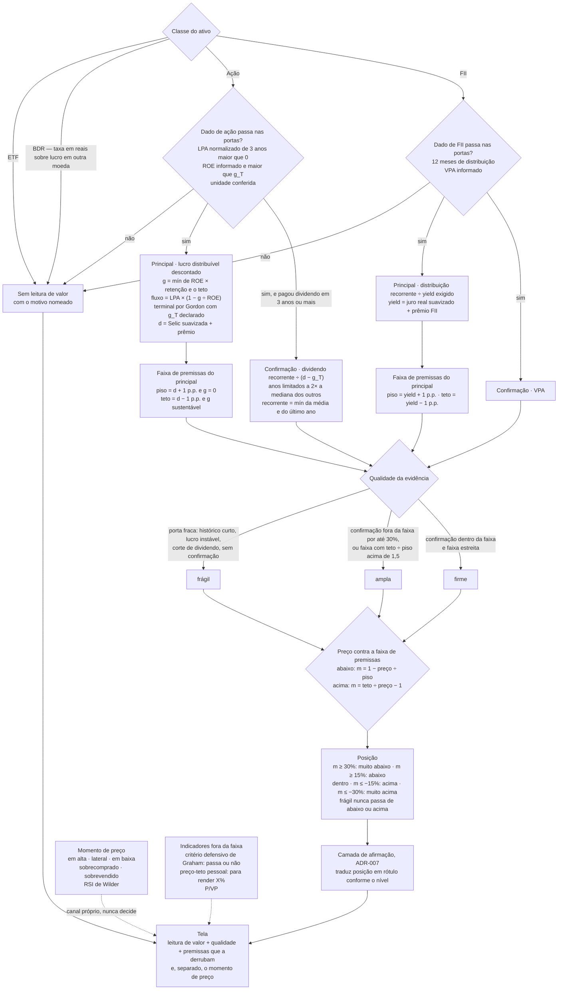

# Revisão da metodologia de preço justo e veredito — 2026-09-23

> **Implementada em 2026-09-23 pela [ADR-014](../decisoes/ADR-014-um-modelo-por-classe.md).** Isto
> é registro, não pendência. Três pontos saíram diferentes do que está escrito abaixo, e a ADR diz
> por quê: a taxa usa a **Selic média de 10 anos**, não de 24 meses (medido, 24 meses punha quase
> toda ação acima do preço justo); o yield de FII sai da **meta de inflação**, não do IPCA de 12
> meses; e o dividendo de confirmação cresce no menor entre o crescimento sustentável e o de longo
> prazo.

Revisão de engenharia financeira do caminho **tipo do ativo → métodos → faixa → margem → veredito**,
como desenhado no diagrama do veredito e implementado em `backend/app/analysis/fair_price.py`,
`decision.py` e `falsifiers.py` (commit `44bee59`).

**Como ler.** Cada afirmação relevante leva uma marca:

- **[Fato]** — verificável no código, na matemática ou na literatura citada
- **[Interpretação]** — leitura financeira fundamentada, mas discutível
- **[Design]** — escolha de modelagem; outra escolha seria igualmente legítima se declarada
- **[Validar]** — só pode entrar em regra de produção depois de backtest fora da amostra

**Nenhum número aqui é backtest.** Os números vêm de três fontes: cálculo analítico, execução das
funções reais do motor com entradas sintéticas (roteiro no [Apêndice](#apêndice--cálculos-reproduzíveis)),
e as medições de produção já registradas nas ADRs 011 e 013.

---

## 0 · Resposta curta às dez perguntas

| # | Pergunta | Resposta |
|---|---|---|
| 1 | O que é defensável? | A **arquitetura de princípios**: faixa em vez de média, margem contra a borda, técnico fora do veredito, silêncio com motivo, falsificador que separa gatilho de premissa, insumo como unidade de evidência. |
| 2 | O que é arbitrário? | Yield de 6%/10%, prêmio de 5 p.p., P/L terminal 15, teto de 25%, crescimento-padrão de 8%, bandas ±15/±30, corte de 2× para dispersão e outlier, regra de 3× no dividendo, RSI 30/70. Nenhum tem calibração declarada. |
| 3 | Vieses sistemáticos? | Sim, pelo menos seis: **Graham nunca vota "caro"** (identidade matemática), viés a favor de quem distribui muito, viés contra crescimento, viés contra BDR por moeda, armadilha de dividendo, e lucro de pico em cíclicas. |
| 4 | Método adequado por classe? | Ação madura pagadora: parcialmente. Crescimento, cíclica, banco, BDR: não. FII: parcialmente, por subtipo. ETF: nenhum método — correto. |
| 5 | Mín–máx é faixa de valor? | **Não.** É a divergência entre modelos que medem coisas diferentes. Funciona como regra de unanimidade, mas unanimidade entre votantes enviesados não vale nada. |
| 6 | A margem está bem definida? | A definição do lado da compra é a clássica. **Do lado da venda, é assimétrica**: −30% dispara com 23% de distância, e +30% exige 43%. |
| 7 | As bandas têm fundamento? | **Não.** São arbitrárias, simétricas numa escala que não é simétrica, e ignoram a qualidade da estimativa. |
| 8 | A ausência de valuation está bem tratada? | O **diagnóstico** está (motivo nomeado). A **decisão** não: emitir "Comprar" por média móvel é mudar de paradigma com o mesmo vocabulário. |
| 9 | O técnico está isolado? | No ramo com faixa, sim, e corretamente. No ramo sem faixa, não, e a regra mistura momentum com reversão à média de forma contraditória. |
| 10 | Arquitetura mais robusta e simples? | **Um modelo principal por classe** com faixa de premissas, **um método de confirmação** e a mesma taxa de desconto para todos. O técnico vira um canal separado com vocabulário próprio. Ver §20. |

---

## 1 · Avaliação estrutural

### A. A árvore faz sentido?

**A separação por classe é necessária, mas insuficiente.** [Interpretação] A classe jurídica (ação,
BDR, FII, ETF) decide *qual fluxo existe*, mas não decide *qual método descreve aquele fluxo*. Dentro
de "ação", um banco, uma exportadora de commodity, uma elétrica pagadora e uma indústria que reinveste
80% do lucro pedem leituras diferentes. A árvore trata as quatro com o mesmo trio.

| Classe | Métodos hoje | Veredito | Motivo financeiro |
|---|---|---|---|
| Ação | Bazin, Graham, lucros descontados | **Parcial** | O trio funciona razoavelmente para empresa madura, pagadora e de lucro estável. Falha em crescimento (Bazin baixo, Graham se abstém, DCF achatado), cíclica (lucro de pico), banco (receita não é o motor do lucro) e prejuízo. |
| BDR | Graham, lucros descontados | **Inadequado** | [Fato] A taxa é a Selic mais 5 p.p., em reais, aplicada a lucro gerado em moeda estrangeira. [Fato] BDR vem sem VPA em 4 de 4 na amostra (10-PROBLEMAS, item 3), então só sobra o DCF, e a faixa é de um ponto só. |
| FII | Bazin, VPA | **Parcial** | Para FII, o Bazin é **mais** defensável do que para ação, porque a Lei 8.668/93 (art. 10) obriga a distribuir 95% do resultado de caixa. O dividendo *é* o fluxo. Mas tijolo, papel, híbrido e FoF têm naturezas distintas, e o VPA significa coisas diferentes em cada um. |
| ETF | nenhum | **Correto no diagnóstico** | [Interpretação] O preço de um ETF é ancorado no valor da cota por arbitragem. "Preço justo do ETF" é o valor dos ativos que ele carrega, não um múltiplo do fundo. O que falha é o que vem depois (§12). |

**Método importante que falta?** [Interpretação] Nenhum método *novo* é necessário. O que falta é
**consistência interna** entre os que existem: o Bazin usa um yield fixo que não conversa com a taxa
do DCF. O DCF soma lucro como se fosse 100% distribuído e ainda cresce como se reinvestisse. Graham usa
uma constante de 1949 sem relação com o juro. A §20 mostra que corrigir essa consistência resolve
banco, crescimento e dupla contagem **sem acrescentar método nenhum**.

---

## 2 · Avaliação de cada método

| Pergunta | Bazin | Graham | Lucros descontados | VPA (FII) |
|---|---|---|---|---|
| 1. Apropriado ao ativo? | FII: sim. Ação pagadora madura: sim. Ação que reinveste: **não**. | Empresa asset-heavy, lucro estável, juro moderado. Fora disso, não. | Como heurística de ação lucrativa, sim. Como DCF, não. | Tijolo e papel: como âncora, sim. Como preço justo, só em parte. |
| 2. Insumo adequado? | Dividendo pago: sim. Média de 5 anos nominal: com defeitos (§3). | LPA dos últimos 12 meses: **não** — Graham usava média de 3 anos. | LPA: aceitável. Crescimento de **receita**: não é crescimento de lucro. | VPA contábil: depende de laudo e marcação. |
| 3. Fórmula correta? | Sim, como capitalização. É Gordon com `g` implícito. | A fórmula é o "número de Graham", **um preço máximo de triagem, não uma estimativa de valor**. | Aritmeticamente correta. **Conceitualmente incoerente**: soma lucro e cresce por reinvestimento ao mesmo tempo. | Trivial. |
| 4. Premissas defensáveis? | O yield fixo, não. | A constante 22,5 supõe juro americano de 1949–1973. | P/L terminal 15 é incoerente com `d` de 17–20%. | Que o contábil reflita o econômico: varia. |
| 5. Parâmetros defensáveis? | 6% e 10%: arbitrários e desancorados do juro. | 15 e 1,5: de Graham, mas aplicados diferente dele. | 5 p.p., 25%, 15 e 8% padrão: arbitrários. | Sem parâmetro. |
| 6. Resultados absurdos? | Sim: armadilha de dividendo e prejuízo com histórico (§3). | Sim: **nunca produz valor abaixo do preço** (§4). | Sim: lucro extraordinário triplica o valor. Sem crescimento medido, inventa 8%. | FoF e fundo em liquidação. |
| 7. Deveria se abster? | Com lucro negativo, corte recente ou menos de 3 anos. | Banco, seguradora, tecnologia, patrimônio negativo. **Não deveria depender do preço.** | Sem crescimento medido, cíclica sem normalização, ROE abaixo do crescimento. | Fundo de desenvolvimento, FoF. |
| 8. Dados adicionais mínimos? | Lucro atual (para detectar insustentabilidade), payout. | LPA de 3 anos. | ROE, payout e LPA normalizado. | Subtipo do fundo. |
| 9. Automatizável? | Sim. | Sim. | Sim. | Sim. |
| 10. Explicável? | Muito. | Muito, mas explica a coisa errada. | Médio. | Muito. |

---

## 3 · Bazin em profundidade

### O que o Bazin é

[Fato] `preço = D ÷ y` é o modelo de Gordon, `P = D ÷ (r − g)`, com `y = r − g`. Escolher `y` é
escolher, ao mesmo tempo, uma taxa de retorno exigida e um crescimento perpétuo, sem declarar nenhum
dos dois.

[Fato] O próprio projeto já reconhece isso (ADR-011): *"Bazin não estima o negócio: diz a que preço
aquele fluxo de dividendo entrega o yield que você pediu. É um teto de compra para um objetivo de
renda."* **E mesmo assim o método entra numa faixa de valor intrínseco.** É a inconsistência
conceitual mais importante do Bazin.

### Os yields de 6% e 10%

[Fato] O critério de 6% é de Décio Bazin (*Faça Fortuna com Ações*, 1992), e é heurística de um
investidor, não resultado de modelo.

[Fato, calculado] Se a taxa exigida é a mesma do DCF (`r = Selic + 5 p.p.`), o yield fixo implica um
crescimento perpétuo nominal de `g = r − y`:

| Selic | `r` | Ação, y = 6% → `g` implícito | FII, y = 10% → `g` implícito |
|---|---|---|---|
| 10% | 15% | **9% ao ano, para sempre** | 5% |
| 12% | 17% | **11%** | 7% |
| 15% | 20% | **14%** | 10% |

[Interpretação] Para ação, um crescimento perpétuo de 9% a 14% nominais é implausível: supera o
crescimento nominal do PIB com folga. **O Bazin de 6% é generoso sempre que o juro é alto**, e o
Brasil passou a maior parte da década recente com juro alto. Para FII de tijolo, cujos aluguéis são
corrigidos pela inflação, `g ≈ IPCA`. Com IPCA de 4% a 5%, os 10% implicam `r` de 14% a 15%, o que é
razoável num regime e errado em outro.

[Fato] **A mesma faixa mistura um método que acompanha o juro (DCF) com outro que o ignora (Bazin).**
Quando a Selic sobe, o teto ou o piso do DCF cai e o do Bazin fica parado. A largura da faixa muda a
cada Copom por razões que não têm nada a ver com o ativo.

**Fixo ou derivado?** [Design] Derivado. A forma mínima que respeita as fontes permitidas (BCB SGS):

```
y_ação = d − g_longo            (mesmo d do modelo de lucro, g_longo declarado)
y_FII  = (juro nominal − IPCA 12m) + prêmio_FII     (tijolo: distribuição cresce com o IPCA)
```

**Ações e FIIs devem ter parâmetros diferentes?** [Interpretação] Sim, mas pelo motivo certo. A
diferença não está no risco: está em `g`. O FII distribui 95% do caixa e cresce pela correção
contratual. A ação distribui parte do lucro e cresce pelo que retém. Parâmetros diferentes são
defensáveis. **Números soltos diferentes, não.**

### Sensibilidade

[Fato, calculado] A elasticidade do preço ao yield é −1: sai de 6% para 5% e o preço sobe 20%; para 7%,
cai 14%; para 10%, cai 40%. **O yield tem o mesmo peso que o próprio dividendo.** Ver §16.

### A preferência do usuário dentro da faixa

[Fato] `desired_yield_for(asset_type, prefs)` deixa a pessoa escolher o yield, e o valor escolhido
entra no Bazin, que entra na faixa, que decide o veredito. [Interpretação] Uma preferência pessoal de
renda passa a definir a borda de uma faixa apresentada como valor. A ADR-013 (item 4) preservou isso de
propósito, e a intenção é boa: a preferência não pode sumir. **Mas o lugar dela é ao lado da faixa,
como "preço-teto para render X%", não dentro dela.**

### Dividendo extraordinário: a regra de 3×

[Fato, verificado no código] A regra usa a mediana de **todos** os anos, inclusive o candidato. O
diagrama diz "mediana dos outros". A diferença é pequena, mas é uma divergência entre o desenho e o
código.

[Fato, executado] O que a regra deixa passar e o que ela descarta:

| Série anual | Recorrente calculado | O que aconteceu |
|---|---|---|
| 1, 1, 1, 1, **2,9** | 1,38 | Escapa por pouco. O Bazin sobe **38%** por um ano atípico. |
| 1, 1, 1, 1, **3,1** | 1,00 | Dispara, e a série inteira vira mediana. |
| 1, 1, **4, 4**, 1 | 1,00 | Dois anos de ciclo descartados por inteiro. |
| 1, 1, 1, **4, 4** (mudança de política) | 1,00 | [Mesmo caminho do código] Uma **mudança estrutural** para cima é lida como ruído. |
| **2, 2, 2**, 0,5, 0,3 (corte) | **1,36** | Nada dispara. O Bazin vale **4,5×** o que o último ano sustenta. |

**Avaliação estatística.** [Interpretação] A regra é um detector de outlier com ponto de corte fixo,
sobre amostras de 3 a 5 pontos, e tem dois defeitos:

1. **É binária**: 2,9× não muda nada, 3,1× troca o estimador inteiro. Um estimador descontínuo numa
   variável contínua gera degraus na tela.
2. **É simétrica no lugar errado**: detecta pico para cima, mas não detecta **corte**, que é o caso que
   custa dinheiro. A armadilha de dividendo — empresa que pagava bem, cortou, e cuja ação caiu — sai
   como "barata" pela média antiga.

**Avaliação financeira.** [Interpretação] Com n ≤ 5, nenhuma regra estatística separa "evento único"
de "mudança de regime". O que separa é informação econômica: **lucro atual**. Dividendo acima do que o
lucro recorrente sustenta não é recorrente, independentemente da série.

### Outros casos pedidos

- **Crescimento do dividendo.** [Fato, calculado] Com o dividendo crescendo 5% ao ano, a média nominal
  de 5 anos fica **9,1% abaixo** do último ano e 13,4% abaixo do próximo. A média pune quem cresce o
  dividendo e favorece quem o reduz.
- **Empresa que não distribui.** [Fato] Sai `sem_dado`. Correto como diagnóstico, mas é também o motivo
  do viés: a faixa perde a perna do dividendo e depende do LPA.
- **FII com distribuição atípica.** [Interpretação] Em FII de papel, a correção monetária dos CRIs é
  distribuída como rendimento. Em 2021–2022, com IPCA alto, isso inflou a distribuição sem aumento de
  valor. A regra de 3× não pega isso, porque a alta durou mais de um ano.
- **Histórico curto.** [Fato] Com menos de 3 anos, usa a média sem guarda. A confiança cai 0,10, mas o
  veredito não muda.
- **Prejuízo com histórico de dividendo.** [Fato, executado] LPA −0,80, dividendos 1,0 · 1,0 · 0,8 ·
  0,5 · 0,0, preço R$ 4: o Bazin sai R$ 11, a faixa é de um ponto, a margem é +64%, e o veredito é
  **"Comprar com convicção", com confiança "baixa"**. É o caso mais grave encontrado nesta revisão: a
  etiqueta mais forte do sistema, sobre a evidência mais fraca, numa empresa que parou de pagar.

---

## 4 · Graham em profundidade

### O problema lógico: a identidade

[Fato, demonstração] Se `P/L ≤ 15` e `P/VP ≤ 1,5`, então:

```
P² = (P/L) · (P/VP) · LPA · VPA ≤ 15 · 1,5 · LPA · VPA = 22,5 · LPA · VPA
⟹  P ≤ √(22,5 · LPA · VPA) = Graham
```

**Sempre que o método se calcula, o preço justo de Graham é maior ou igual ao preço de mercado.**
[Fato, executado] Uma varredura de 200 mil combinações aleatórias de LPA, VPA e preço, sobre a função
real: 31.281 casos com Graham calculado, **zero** com preço acima de Graham.

Consequências:

1. **Graham nunca diz "caro".** Ou diz "barato ou justo", ou se cala.
2. **Com Graham na faixa, venda é impossível.** O teto é ≥ Graham ≥ preço, então a margem é ≥ 0. O
   veredito fica entre Manter e Comprar com convicção.
3. **O método some exatamente quando a ação está cara.** É viés de seleção: o votante que diria "caro"
   é removido da urna justamente por a ação estar cara. [Executado] LPA 1,00, VPA 8,00, Bazin R$ 5,
   DCF R$ 9,02, Graham R$ 13,42. A **R$ 12,00** (P/VP 1,50), a faixa é R$ 5–13,42 e o veredito é
   **Manter**. A **R$ 12,01** (P/VP 1,501), Graham se abstém, a faixa encolhe para R$ 5–9,02 e o
   veredito é **Vender com urgência** (margem −33%). **Um centavo atravessa quatro bandas.**
4. **A aplicabilidade do método depende do preço que ele julga.** Isso é circular. A aplicabilidade
   deveria depender do negócio (setor, estabilidade do lucro), nunca da cotação.

[Fato, literatura] O número de Graham não é, na origem, uma fórmula de valor. É o critério 6 e 7 do
investidor defensivo (*The Intelligent Investor*, ed. 1973, cap. 14): preço até 15× o **lucro médio de
3 anos** e até 1,5× o patrimônio, **ou o produto dos dois até 22,5**. O próprio Graham admitia P/L 9
com P/VP 2,5. A raiz de 22,5 × LPA × VPA é o preço em que um ativo *deixa de passar no filtro*. Usá-la
como preço justo e, ao mesmo tempo, exigir o filtro é pedir ao método que confirme a si mesmo.

[Fato] A implementação diverge de Graham em dois pontos: usa LPA de 12 meses em vez da média de 3 anos,
e exige os dois limites separadamente em vez do produto. Ambos tornam o método mais volátil e mais
restritivo sem ganho de fundamento.

### A fórmula em empresas modernas

[Fato, calculado] 22,5 = 15 × 1,5, e P/L 15 equivale a um rendimento de lucro de 6,7%. Ajustar ao juro:

| Rendimento de lucro exigido | P/L máximo | Constante | Efeito no Graham |
|---|---|---|---|
| 6,7% (original) | 15 | 22,5 | — |
| 10% | 10 | 15 | **−18%** |
| 12% | 8,3 | 12,5 | −25% |
| 15% | 6,7 | 10 | −33% |

(Item A3 do 10-PROBLEMAS, agora com a magnitude.)

| Situação | Adequação | Motivo |
|---|---|---|
| Asset-light, tecnologia | Inadequado | Patrimônio contábil não mede o ativo que gera o lucro (marca, software, pessoas). P/VP alto é característica, não sobrepreço. |
| Bancos | Parcial | P/VP é métrica central de banco, mas 1,5 exclui bancos de ROE alto e aprova bancos de ROE baixo. O correto é P/VP justificado, `(ROE − g) ÷ (d − g)`. |
| Seguradoras | Parcial | Mesma lógica do banco. Holding que consolida por equivalência distorce o VPA. |
| Cíclicas | Inadequado | LPA de pico passa no filtro de P/L com folga, e o método aprova exatamente no topo. |
| Patrimônio pouco representativo | Inadequado | Recompra agressiva, ágio amortizado, patrimônio negativo. |
| Lucro volátil | Inadequado | LPA de 12 meses é o pior insumo possível. Graham usava a média. |

**Filtro absoluto?** [Interpretação] Não. Um filtro dependente do preço cria descontinuidade: a ação
cruza P/L 15 por um centavo e perde um método inteiro, e a faixa salta.

---

## 5 · Lucros descontados em profundidade

### O que o modelo é

[Fato] `V = Σ LPA·(1+g)^t / (1+d)^t + LPA·(1+g)^5 · 15 / (1+d)^5`.

**Não é um DCF** (não há fluxo de caixa livre, capex, capital de giro nem dívida). **Não é uma
capitalização pura** (tem fase explícita). É um **híbrido: desconto de lucro contábil com saída por
múltiplo**. [Fato, calculado] O valor terminal responde por **67% a 79%** do total em toda a grade
testada. Na prática, é o P/L 15 aplicado ao lucro do ano 5, trazido a valor presente, com uma
correção pequena pela fase explícita.

### Inconsistência 1 — dupla contagem do lucro retido

[Fato, teoria] Para o LPA crescer a `g`, a empresa precisa reter e reinvestir `b = g ÷ ROE` do lucro
(Damodaran, *Investment Valuation*, crescimento fundamental. Koller, Goedhart e Wessels, *Valuation*,
"value driver formula": `V = L·(1 − g/RONIC) ÷ (d − g)`). Somar o LPA inteiro trata o lucro retido
como se fosse distribuído **e** credita o crescimento que só existe porque ele foi retido.

[Fato, calculado] Com `d` = 18%, `g` = 10% e ROE = 15%, o distribuível é 1/3 do lucro. A fase explícita
vale 28% do total. Descontar só o distribuível derruba o valor em **~19%** (de 14,63 para 11,90 por
real de LPA). Quanto maior `g` e menor o ROE, maior o erro.

### Inconsistência 2 — múltiplo terminal incoerente com a taxa

[Fato, calculado] Pelo próprio Gordon, o P/L de uma empresa em regime estável é
`payout · (1 + g_T) ÷ (d − g_T)`:

| `d` | `g_T` | Payout | P/L coerente |
|---|---|---|---|
| 15% | 4% | 50% | 4,7 |
| 15% | 6% | 100% | 11,8 |
| 18% | 4% | 100% | 7,4 |
| 20% | 6% | 100% | 7,6 |

Para P/L 15 ser coerente com `d` = 20% e payout de 100%, o crescimento perpétuo teria de ser
**12,5% ao ano**. [Interpretação] **O múltiplo terminal fixo neutraliza a própria ligação com a
Selic**: a taxa só age sobre os cinco anos explícitos e sobre o desconto do terminal, não sobre o
múltiplo. Por isso subir `d` de 18% para 21% derruba o valor em só 10,5% (§16), quando num modelo
coerente derrubaria muito mais.

[Interpretação] Não se conclui daí que o modelo superavalia sempre. A taxa de Selic + 5 p.p. pode ser
alta demais (ver abaixo), e as duas distorções se compensam parcialmente. **Dois erros que se
compensam não são um acerto**: a compensação muda de sinal com o juro.

### Inconsistência 3 — crescimento de receita como crescimento de lucro

[Fato] `g` sai de `revenueGrowth` da BRAPI ou, na falta, da variação anual da receita. [Validar na
documentação] No esquema do Yahoo, que a BRAPI espelha, `revenueGrowth` costuma ser a variação do
**trimestre mais recente** contra o mesmo trimestre do ano anterior. Se for isso, um único trimestre
projeta cinco anos.

[Interpretação] Receita só vira LPA com margem constante e número de ações constante. Falta:

- **margem**: cíclica e commodity têm receita e lucro descolados;
- **diluição**: emissão de ações reduz o LPA mesmo com o lucro crescendo;
- **banco e seguradora**: "receita" oscila com a Selic, não com o lucro.

### Inconsistência 4 — dado inventado

[Fato] Sem crescimento medido, `dcf_fair_price` usa **8%** (`DCF_DEFAULT_GROWTH_PCT`). O
`growth_source` registra `ausente`, mas o número entra na faixa como qualquer outro. Isso contradiz o
invariante *"o sistema não inventa dado"*. [Fato] Sem Selic, a taxa cai para 13% fixos, contra ~20%
com Selic a 15%: o DCF sobe cerca de 30% por falta de um dado macro, e ninguém vê.

### A taxa `d` = Selic + 5 p.p.

[Interpretação] A Selic é taxa de **um dia**. Custo de capital próprio é taxa de **longo prazo**. A
prática de mercado no Brasil parte da NTN-B longa ou do prefixado longo, e não da Selic. Consequências
de usar a Selic do dia:

- todo preço justo muda a cada reunião do Copom;
- no pico do ciclo, a Selic costuma ficar acima dos juros longos, e o modelo penaliza mais do que o
  mercado; no fundo do ciclo, o contrário.

[Design] O **mesmo** prêmio para toda empresa é defensável como simplificação declarada (a ADR-013
argumenta bem que sem beta seria inventar). O que não é defensável é o **mesmo `d` com fluxos em
moedas diferentes** (BDR, abaixo).

### BDR: desconto em reais sobre lucro em moeda estrangeira

[Fato, teoria] Taxa e fluxo precisam estar na mesma moeda (Damodaran). A Selic embute a inflação
brasileira e o risco-país. Descontar lucro em dólar, convertido no câmbio de hoje, por uma taxa em
reais, é pagar a inflação brasileira sem receber a correção cambial que a compensa (paridade de juros).
[Fato, calculado] Com `d` em reais de 20% contra 9,5% em dólares, o valor sai com **0,67×** o que
deveria. **Todo BDR sai sistematicamente caro.**

[Validar] É preciso conferir se o `earningsPerShare` que a BRAPI entrega para BDR vem por BDR e em
reais, ou por ação no exterior e em moeda de origem. Se for o segundo caso, o erro de escala se soma ao
erro de taxa.

### Demais pontos pedidos

- **Cinco anos bastam?** [Interpretação] Para heurística, sim, desde que o terminal seja coerente. O
  problema não é o horizonte, é o terminal.
- **Crescimento negativo.** [Fato] O piso é 0. Empresa encolhendo é avaliada como estável. O
  `growth_source = contracao` registra, mas o valor não reflete.
- **Lucro extraordinário.** [Fato, executado] LPA de 1,0 para 3,0 numa ação a R$ 9: o DCF vai de
  R$ 13,50 para **R$ 40,49** e Graham de R$ 16,43 para R$ 28,46. O Bazin segura o piso e o veredito
  continua Manter, mas só porque o Bazin é baixo. Numa empresa sem dividendo, o lucro extraordinário
  vira compra.
- **Otimismo.** [Interpretação] Teto de 25% por cinco anos multiplica o LPA por 3,05. É generoso com
  quem cresce 25% num trimestre e conservador com quem cresce 30% de forma sustentável.

---

## 6 · VPA em profundidade

[Fato] A regra contábil de FII (ICVM 516) manda registrar o imóvel para renda a valor justo, em geral
por laudo. O VPA de tijolo é, portanto, uma **avaliação econômica defasada**, não custo histórico.

| Tipo | VPA como preço justo | Motivo |
|---|---|---|
| Tijolo | Âncora defensável, com defasagem | O laudo é anual e feito por avaliador contratado. Em mercado em queda, o VPA atrasa. Vacância e crédito do inquilino entram devagar. |
| Papel | **Mais defensável** | A carteira de CRIs tem valor mais próximo do contábil, e o P/VP de fundo de papel orbita 1. O risco é crédito: CRI inadimplente só entra no VPA quando provisionado. |
| Híbrido | Parcial | Mistura as duas defasagens. |
| FoF | **Enganoso** | O VPA é soma de cotas a preço de mercado, e já carrega o desconto ou o prêmio dos fundos investidos. Comparar o preço do FoF com esse VPA conta o desconto duas vezes. |
| Desenvolvimento | Enganoso | O patrimônio é obra em curso a custo. |
| Ativo depreciado | Superestima | Imóvel obsoleto com laudo otimista. |
| Ativo valorizado | Subestima | Se o laudo atrasa em relação ao mercado. |

**Liquidez e desconto persistente.** [Interpretação] FII pequeno e ilíquido negocia com desconto
estrutural sobre o VPA. Isso é prêmio de liquidez, não oportunidade. O VPA não sabe disso.

**Isolado ou acompanhado?** [Interpretação] Acompanhado. O VPA responde "quanto vale o que o fundo
tem"; o Bazin responde "quanto vale o que o fundo paga". Os dois juntos dizem algo que nenhum diz
sozinho: **distribuição alta com P/VP baixo** pode ser oportunidade ou pode ser distribuição
insustentável num ativo que o mercado já descontou.

[Fato] O sistema não tem o subtipo do FII (a BRAPI não o entrega de forma estruturada). Sem ele, a
regra precisa ser uma só e declarar a limitação.

---

## 7 · A combinação dos métodos — a parte crítica

### O que o mín–máx realmente é

[Interpretação] `piso = mín`, `teto = máx`, compra abaixo do piso e venda acima do teto é uma **regra
de unanimidade**: compra só se *todos* os métodos disserem barato, e vende só se *todos* disserem caro.
Isso é conservador dos dois lados, e **como regra de decisão é defensável**.

**O problema não é a regra. É que os votantes não são comparáveis, e dois deles são enviesados por
construção:**

- **Graham só vota "barato"** (§4). Com ele presente, a unanimidade para vender é impossível.
- **O Bazin vota pela política de dividendo**, não pelo valor. Empresa que reinveste tem Bazin baixo e,
  portanto, piso baixo. Unanimidade para comprar fica quase impossível.

[Fato, executado] Crescedora de baixa distribuição (tipo WEGE3): preço R$ 50, Bazin R$ 12,17, DCF
R$ 23,53, Graham ausente. Faixa R$ 12–24, margem −112%, **Vender com urgência**. Se a empresa tivesse
o mesmo lucro e distribuísse tudo, o Bazin subiria e o veredito mudaria. **O veredito depende do payout
mais do que do valor.**

### Faixa entre R$ 10 e R$ 30: incerteza ou divergência?

[Interpretação] **Divergência entre modelos, na maior parte dos casos.** Incerteza sobre o valor
intrínseco é a dispersão das estimativas *de um mesmo modelo* quando as premissas variam dentro do
plausível. Divergência entre modelos é a distância entre respostas a *perguntas diferentes*: "que
preço rende 6%?", "até que preço passa no filtro defensivo?", "quanto valem os lucros projetados?".

Uma faixa de R$ 10 a R$ 30 só seria incerteza real se os três métodos fossem estimadores razoáveis do
mesmo valor para aquele ativo. Quando um deles não se aplica ao ativo (Bazin numa empresa que
reinveste), a faixa **mede o erro de aplicação**, e o "Manter" que sai dela é um artefato.

[Fato, calculado] Consequência prática: com faixa de R$ 10 a R$ 30, o ativo é Manter para qualquer
preço entre R$ 8,50 e R$ 34,50 — uma janela de 4×.

[Fato, simulado] A faixa mín–máx **cresce mecanicamente com o número de métodos**. Com estimativas
lognormais independentes de desvio 30%, a razão teto/piso mediana vai de 1,33 (dois métodos) para 1,62
(três) e 1,81 (quatro). **Acrescentar método, mesmo bom, empurra o sistema para Manter.**

### Comparação das alternativas

| Regra | O que produz | Quando é certa | Quando falha |
|---|---|---|---|
| **Mín–máx (atual)** | Unanimidade | Métodos comparáveis e sem viés | Métodos com viés unilateral (Graham) ou inaplicáveis ao ativo (Bazin em crescedora). Largura cresce com o número de métodos. |
| **Média** | Um número | Estimadores do mesmo alvo com erros parcialmente independentes (Bates e Granger, 1969: a média simples é difícil de bater) | Alvos diferentes — o caso daqui. Finge precisão (ADR-011 já rejeitou, com razão). |
| **Mediana** | Um número robusto | Três ou mais estimadores do mesmo alvo | Com dois métodos, é a média. Com três heterogêneos, escolhe o do meio por acaso. |
| **Média ponderada** | Um número | Quando há base para os pesos | Sem calibração, os pesos são opinião com casas decimais. |
| **Mediana robusta / aparada** | Um número | Muitos estimadores | Aqui há no máximo três. |
| **Modelo principal + confirmação** | Um valor com faixa de premissas, e um sinal de concordância | Quando se sabe qual método descreve o fluxo do ativo | Exige escolher o principal por classe, uma decisão que precisa ser declarada. |

[Interpretação] A literatura de combinação de previsões só se aplica a estimadores **do mesmo alvo**.
Como os métodos daqui têm alvos diferentes, **nenhuma regra de combinação é principiada** enquanto eles
não forem reconciliados. Por isso a recomendação da §20 não troca a regra de combinação: **ela troca o
que é combinado**. O modelo principal gera a faixa (incerteza real, por premissas). O método de
confirmação diz se outra leitura concorda (divergência, tratada como sinal de qualidade).

---

## 8 · Outliers

[Fato] A regra só roda com três ou mais métodos, marca apenas o **primeiro** que destoa (há um
`break`), e não exclui nada.

| Cenário | O que a regra faz | O que deveria acontecer |
|---|---|---|
| Dois métodos | Nada (só a dispersão ≥ 2× derruba para `ampla`) | Com dois, não existe "outlier": existe discordância. Reportar a discordância. |
| Três métodos | Marca quem está a mais de 2× da mediana | Perguntar **por que** destoa (abaixo). |
| Método inadequado ao ativo | Marca, e o método segue definindo a borda | **Não deveria ter entrado.** Aplicabilidade é filtro econômico *antes* da faixa, não pós-teste estatístico. |
| Divergência por premissa (DCF alto por `g` alto) | Marca | É legítimo. Mostrar a premissa responsável e a faixa sem ela. |
| Outlier legítimo (Bazin de quem exige 12%) | Marca e mantém — decisão correta da ADR-013 | Tirar o yield pessoal da faixa resolve na raiz (§3). |
| Dado defeituoso (LPA com lucro não recorrente) | Marca, mantém, e o dado defeituoso vira borda | Deve ser pego **na qualidade do dado** (LPA normalizado × LPA 12m), antes. |

[Interpretação] **Um outlier entre métodos de valuation quase nunca é um erro estatístico: é
informação econômica.** Os casos típicos daqui são: Bazin baixo por payout baixo, DCF alto por
crescimento alto, Graham alto por patrimônio alto. Cada um tem uma causa nomeável. A resposta certa é:

1. filtrar por **aplicabilidade econômica** antes (payout, setor, lucro estável);
2. **reduzir a qualidade** quando sobra divergência;
3. **apresentar separado** o método discordante, com a premissa que o afasta.

Excluir por estatística com n ≤ 3 não tem poder. Manter sem explicar confunde.

---

## 9 · O conceito de qualidade

[Fato] Hoje: `fragil` se um insumo só; `ampla` se há outlier ou dispersão ≥ 2×; `firme` nos demais.

**Três defeitos:**

1. [Fato] **"Firme" aceita dispersão de até 1,99×.** Métodos em R$ 10 e R$ 19,90 saem "firmes".
   [Interpretação] 2× não é convergência em nenhuma leitura razoável.
2. [Fato] **A independência é medida pela etiqueta do insumo.** Graham leva a etiqueta `lucro`, mas usa
   lucro **e** patrimônio. Bazin e Graham contam como dois insumos, mas o dividendo é uma fração do
   lucro (§15).
3. [Fato] **A qualidade ignora a qualidade do dado.** Anos de histórico entram só na confiança (−0,10),
   e não na faixa. Lucro instável, corte de dividendo, crescimento inventado e taxa de reserva não
   entram em lugar nenhum.

**Quantidade de métodos está sendo confundida com qualidade de evidência?** Parcialmente. A ADR-013
corrigiu o pior disso (métodos → insumos), mas o critério continua sendo *contagem*.

**Fatores que deveriam definir a qualidade** [Design, em ordem de importância]:

| Fator | Entra? | Por quê |
|---|---|---|
| Adequação do método ao ativo | **Sim, como porta** | Método inadequado não é evidência fraca, é evidência nenhuma. |
| Qualidade do dado (unidade, completude, dado inventado) | **Sim, como porta** | Crescimento de 8% padrão não pode sair "firme". |
| Estabilidade do lucro | **Sim** | LPA de 12m longe do normalizado indica ano atípico. |
| Estabilidade do dividendo / corte recente | **Sim** | É a armadilha principal do Bazin. |
| Sensibilidade às premissas (largura da faixa do modelo principal) | **Sim** | É a incerteza real. |
| Concordância do método de confirmação | **Sim** | É a evidência independente. |
| Comprimento do histórico | Sim | Já entra. Deveria entrar na faixa também. |
| Qualidade do balanço (dívida) | Não por enquanto | Afeta risco, não precisão da estimativa. Pertence ao score. |
| Número de métodos | **Não** | Contar métodos é o erro que se quer evitar. |
| Presença de outlier | Não isoladamente | Já está capturada pela concordância. |

---

## 10 · Margem de segurança

### O lado da compra

[Fato, literatura] `(piso − preço) ÷ piso` é a definição clássica de margem de segurança: desconto
sobre o valor estimado (Graham; Klarman). **Medir contra o piso** em vez do centro é a parte boa da
ADR-011: "mesmo na leitura mais pessimista, está barato". [Interpretação] Isso é coerente **se o piso
for a leitura pessimista de um modelo aplicável**. Hoje o piso é frequentemente o Bazin de uma empresa
que reinveste, e aí "abaixo do piso" significa "rende mais de 6%", não "está barato".

### O lado da venda: a assimetria

[Fato, calculado] As bandas usam o mesmo número dos dois lados, mas as duas fórmulas não são
simétricas:

| Banda | Preço | Distância até a borda | Distância log |
|---|---|---|---|
| +15% | 0,85 × piso | preço precisa subir **17,6%** | 0,163 |
| −15% | 1,15 × teto | preço precisa cair **13,0%** | 0,140 |
| +30% | 0,70 × piso | preço precisa subir **42,9%** | 0,357 |
| −30% | 1,30 × teto | preço precisa cair **23,1%** | 0,262 |

**"Vender com urgência" dispara com pouco mais da metade da distância que "Comprar com convicção"
exige.** Além disso, a margem de venda vai a −∞ (WEGE3 saiu −118%), e a de compra é limitada a 100%.

[Necessidade matemática] Para simetria em distância log, basta definir o lado da venda contra o
**preço**:

```
preço < piso   →  margem = (piso − preço) ÷ piso       = 1 − preço/piso
preço > teto   →  margem = (teto − preço) ÷ preço      = teto/preço − 1   (≥ −100%)
```

Assim, ±30% correspondem à mesma distância log (0,357) e a escala fica limitada nos dois lados. [Design]
Uma assimetria **pode** ser desejada (aversão a perda justificaria comprar com mais exigência que
vender), mas precisa ser declarada, não acidental.

### Contra o centro ou contra a borda?

| Referência | Vantagem | Desvantagem |
|---|---|---|
| Centro (média, mediana) | Um número, sensível a qualquer desvio | Finge precisão. Veredito oscila com ruído. |
| Borda (atual) | Conservador, admite "dentro da faixa" | Só faz sentido se a faixa for incerteza real, e não divergência. |
| Upside até o centro | Intuitivo para o usuário | Ignora a incerteza. |

[Interpretação] **A margem contra a borda é a escolha certa, desde que a faixa seja a faixa de premissas
de um modelo aplicável** (§20). O conceito da ADR-011 fica; muda o que é a faixa.

---

## 11 · Bandas de decisão

[Fato] ±15% e ±30% não têm derivação escrita em nenhuma ADR nem no 04-CALCULOS. **São arbitrárias.**

| Pergunta | Resposta |
|---|---|
| Fundamentação financeira? | Nenhuma declarada. Os números lembram convenções de mercado ("margem de 30%"), mas convenção não é calibração. |
| Simétricas? | Na fórmula atual, não (§10). |
| Depender da volatilidade? | [Interpretação] Sim, em princípio: 30% num FII de papel de baixa volatilidade é um evento raro, e numa small cap é um mês ruim. Mas volatilidade de preço mede risco de mercado, não erro do valuation. **A dependência certa é da incerteza da estimativa** (largura da faixa de premissas), não do preço. |
| Depender da qualidade? | **Sim, e é a mudança mais barata.** Hoje, "Comprar com convicção" sai com confiança "baixa" (§3). Etiqueta forte deveria exigir evidência firme. |
| Depender do tipo de ativo? | Indiretamente, pela largura da faixa. Números por classe seriam mais parâmetros sem calibração. |
| "Convicção" de valuation apenas? | [Interpretação] Não. Convicção exige evidência independente e dado de qualidade. Uma margem sozinha é uma leitura, não uma convicção. |
| Há evidência para transformar margem em compra e venda? | [Fato] **Não no sistema.** Não há backtest. [Fato] A BRAPI não entrega fundamentos *point-in-time* (como estavam na data, antes de reapresentações), e sem isso qualquer backtest tem viés de antecipação. |

**O que seria necessário para justificar as bandas empiricamente** [Validar]:

1. Série histórica de fundamentos **point-in-time** e universo **sem viés de sobrevivência**
   (incluindo empresas deslistadas). [Interpretação] Os dados abertos da CVM (DFP/ITR) teriam isso,
   mas o invariante "só BRAPI e BCB SGS" precisaria ser revisto.
2. Retorno à frente (12 e 24 meses) por decil de margem, **fora da amostra** e com custos.
3. Monotonicidade: o retorno médio deveria crescer com a margem. Se não crescer, a banda não tem poder.
4. Estabilidade entre regimes de juro.

Até lá, os números devem ser tratados como **convenções declaradas**, e o vocabulário deveria refletir
isso (§20: "abaixo da faixa", e não "comprar").

---

## 12 · Ausência de preço justo

[Fato] Sem faixa, o sistema usa tendência + RSI e emite Comprar, Vender ou Manter com `basis: trend`
e confiança 0,25.

**É defensável usar análise técnica para comprar ou vender quando não há valor fundamental?**
[Interpretação] **Não, com o mesmo vocabulário.** O motivo não é que a análise técnica seja inútil (ver
§13), mas que ela responde a outra pergunta. O veredito com faixa diz "o preço está longe do que o
negócio sustenta". O veredito por tendência diz "o preço vem subindo". São afirmações de naturezas
diferentes, e a mesma palavra "Comprar" as torna indistinguíveis para quem lê. `basis` resolve para a
máquina, não para a pessoa.

**Pior: a ausência de valuation é, ela mesma, informação.** [Fato] O ramo sem faixa inclui "empresa com
prejuízo e sem dividendo". [Interpretação] Dizer "Comprar" a uma empresa com prejuízo porque a média de
50 cruzou a de 200 inverte a hierarquia: a falta de fundamento, que deveria elevar a cautela, é
substituída pelo sinal de preço.

**ETF.** [Interpretação] O que se pode dizer de um ETF de índice é: custo, liquidez, aderência ao índice
e, se houver dado, o valuation agregado do índice (rendimento de lucro do índice contra o juro real).
Um "Comprar" por cruzamento de médias num ETF de índice é *market timing*, e o produto não tem evidência
de que o faça bem.

**Recomendação** [Design]: sem faixa, a leitura de valor é **"Sem leitura de valor"**, com o motivo. O
momento de preço aparece num canal próprio, com vocabulário próprio ("em alta", "em baixa",
"sobrevendido"), e nunca com Comprar ou Vender.

---

## 13 · RSI e tendência

[Fato] A regra atual:

```
alta  e RSI < 70  → Comprar          (momentum)
baixa e RSI > 30  → Vender           (momentum)
RSI ≤ 30          → Comprar          (reversão à média)
RSI ≥ 70          → Manter           (reversão à média)
```

**Contradição interna.** [Fato] Um ativo em tendência de baixa com RSI 35 é **Vender**. Se ele cair mais
e o RSI for a 29, vira **Comprar**. Mais queda troca venda por compra. [Interpretação] A regra usa
momentum enquanto o movimento é moderado e reversão à média quando é forte. São hipóteses opostas sobre
o mesmo preço, e a regra alterna entre elas por um limiar.

**Evidência** [Fato, literatura, sem extrapolar para a B3]:

- Momentum de médio prazo (3 a 12 meses) tem evidência ampla em várias classes e mercados (Jegadeesh e
  Titman, 1993, transversal; Moskowitz, Ooi e Pedersen, 2012, série temporal).
- Regras de médias móveis mostraram poder no Dow Jones histórico (Brock, Lakonishok e LeBaron, 1992),
  mas a correção por mineração de dados (Sullivan, Timmermann e White, 1999) e a deterioração fora da
  amostra enfraquecem a conclusão.
- Osciladores como o RSI em 30/70 não têm evidência robusta de retorno anormal após custos.
- **Nada disso foi testado na B3 pelo projeto.** [Validar]

**Implementação.** [Fato] O RSI do código é a média simples dos últimos 14 movimentos (variante de
Cutler), não a suavização de Wilder, que é a das plataformas de gráfico. O usuário que conferir o número
no gráfico verá outro valor. [Fato] Com histórico curto, a tendência passa a ser 20×50 em vez de 50×200,
com a mesma etiqueta de "tendência".

**Riscos pedidos:** comprar em queda forte só porque RSI < 30 (é exatamente o que a regra faz); vender
em alta forte (RSI ≥ 70 dá Manter, o que é mais prudente do que a regra de baixa); falsos sinais em
mercado lateral, onde o cruzamento de médias oscila; mudança de regime, que nenhum dos dois indicadores
antecipa.

---

## 14 · Separação entre valuation e técnico

[Interpretação] **A separação da ADR-013 é conceitualmente correta, e é a melhor decisão do desenho.**

- Valuation estima valor. O técnico descreve o caminho do preço. Um não informa o outro.
- Tendência e RSI saem **da mesma série de preço**. Contá-los como duas evidências seria contar uma duas
  vezes, como a ADR observa. E somá-los à confiança do valuation seria misturar precisão da estimativa
  com direção do preço.
- O preço já entra no valuation pela margem. Deixar o técnico mexer no veredito seria usar o preço duas
  vezes.

**Arquitetura melhor** [Design]: dois sinais, nunca somados, com vocabulários disjuntos.

```
Leitura de valor:   muito abaixo · abaixo · dentro · acima · muito acima  (+ qualidade)
Momento de preço:   em alta · lateral · em baixa  (+ sobrecomprado / sobrevendido)
```

A pessoa recebe os dois, lado a lado. "Abaixo da faixa, em baixa" é uma combinação legítima e útil
("barato e ainda caindo"). O sistema não a resolve por ela.

---

## 15 · Dupla contagem

| Par | Relação | Consequência |
|---|---|---|
| Dividendo × LPA | [Fato] Dividendo = payout × lucro. A Lei das S.A. (art. 202) prevê dividendo obrigatório, tipicamente 25% do lucro ajustado. | Bazin e os métodos de lucro dependem do mesmo lucro, em janelas diferentes. |
| Graham × DCF | [Fato] Mesmo LPA de 12m. | Um erro no LPA move os dois juntos. O projeto já trata isso. |
| Graham × VPA | [Fato] Graham usa o VPA, mas leva a etiqueta `lucro`. | Independência contada por etiqueta, não por dado. |
| VPA × lucro | [Interpretação] O patrimônio é lucro retido acumulado. | Correlacionado com o lucro de longo prazo, não com o ruído do lucro de 12m. |
| Receita × LPA | [Fato] O DCF usa a receita como crescimento do LPA. | Correlação forte em empresa estável, fraca em cíclica. |
| Preço × Graham | [Fato] O filtro de Graham usa o preço. | O valuation depende do que julga. |
| P/L × P/VP | [Fato] Ambos têm o preço no numerador. | O filtro de Graham é, na prática, uma restrição sobre o preço. |

[Fato, executado] Um lucro extraordinário (LPA 3×) move Graham em +73% (raiz) e o DCF em +200%
(linear), e deixa o Bazin intocado. Os métodos "de lucro" não são duas evidências sobre o mesmo erro:
são **uma evidência com duas elasticidades**.

**O que deveria contar como independência** [Interpretação]: duas leituras são independentes quando
**seus erros de medida não vêm da mesma fonte**. Pela ordem de independência real:

1. **Caixa efetivamente pago nos últimos anos** (dividendo histórico): observado, não contábil.
2. **Lucro contábil normalizado**: contábil, sujeito a itens não recorrentes.
3. **Patrimônio**: contábil e acumulado, correlacionado com o lucro de longo prazo.

A comparação mais informativa que o sistema pode fazer com os dados que já tem é **"o caixa distribuído
confirma o lucro contábil?"**. Um modelo de lucro coerente (payout = 1 − g/ROE) e um modelo de dividendo
com o mesmo `g` convergem **matematicamente** quando a empresa distribui o que pode. Se não convergem, a
divergência diz algo concreto: ou o lucro não vira caixa, ou a política de distribuição mudou. É aí que
mora a independência, e é isso que a §20 usa.

---

## 16 · Sensibilidade

[Fato, calculado com as funções reais] Variação do preço justo ao mover um parâmetro, em torno de uma
base típica (`d` = 18%, `g` = 10%, P/L terminal 15):

| Parâmetro | Movimento | Efeito | Classe |
|---|---|---|---|
| Múltiplo terminal | 15 → 10 / 15 → 20 | **−24% / +24%** | **Alto** — responde por 67–79% do valor |
| Crescimento `g` | 10% → 5% / 10% → 15% | **−18% / +22%** | **Alto** — de 0% a 25%, o valor vai de 9,68 a 25,97 por real de LPA (2,7×) |
| LPA | −20% | −20% no DCF, −11% no Graham | **Alto**, e move **duas** bordas juntas |
| Yield do Bazin | 6% → 5% / 7% / 10% | **+20% / −14% / −40%** | **Alto** — elasticidade −1 |
| Taxa `d` (Selic, prêmio) | 18% → 15% / 21% | +12% / −10,5% | **Médio hoje** — seria **alto** num modelo coerente, porque o P/L terminal fixo absorve a taxa |
| VPA | −20% | −11% no Graham; −20% no VPA de FII | Médio em ação, **alto** em FII |
| Histórico de dividendo | janela, regra de 3×, corte | −9% a −13% (inflação) · +38% (extraordinário que escapa) · 4,5× (corte) | Médio no caso típico, **alto** nos casos de borda |
| Preço atual | ±1% | ±1% na margem, **e descontínuo**: cruzar P/L 15 remove Graham da faixa | **Alto e descontínuo** |

**O que o produto deveria submeter à sensibilidade** [Design]:

1. **Taxa de desconto** (±1 p.p.) — a premissa mais discutível e a mais comum a todos os métodos.
2. **Crescimento** (0 ao valor sustentável) — a premissa mais otimista.
3. **Múltiplo terminal**, enquanto existir. Com terminal por Gordon, ele deixa de ser parâmetro e passa a
   ser consequência de `d` e `g`.

Esses três definem a **faixa de premissas** da §20. Yield do Bazin e LPA não entram como sensibilidade:
o yield sai de `d`, e o LPA se trata na qualidade do dado (normalização).

---

## 17 · Falhas de regime

| Grupo | Adequação | Motivo |
|---|---|---|
| Crescimento | **Inadequado** | Bazin baixo (payout baixo) vira piso, Graham se abstém (P/L > 15), DCF limitado a 25% com terminal 15. Sai "Vender com urgência" de forma quase garantida. |
| Madura | **Parcial** | O melhor caso do desenho. Resta o Graham que impede a venda e o terminal incoerente. |
| Dividendos | **Parcial** | Bazin adequado, com risco de armadilha (corte não detectado) e yield desancorado. |
| Cíclica | **Inadequado** | LPA de pico entra no DCF e no Graham. Dividendo de pico entra no Bazin. A regra de 3× não pega ciclos de dois anos. |
| Bancos | **Parcial** | Bazin funciona (alto payout). Graham penaliza bancos de ROE alto. DCF com crescimento de receita bancária não tem significado. |
| Seguradoras | **Parcial** | Como bancos, mais a distorção de holding por equivalência. |
| Commodities | **Inadequado** | Como cíclica, mais dividendo extraordinário recorrente em ciclos longos. |
| Com prejuízo | **Inadequado** | Sem métodos de lucro, o Bazin do histórico decide sozinho e pode dar "Comprar com convicção" (§3). Sem dividendo, cai na tendência. |
| Patrimônio negativo | **Parcial** | Graham se abstém corretamente. O DCF continua, sem saber da dívida. |
| FII de tijolo | **Parcial** | Bazin e VPA fazem sentido. Yield fixo e VPA defasado. |
| FII de papel | **Parcial** | VPA bom. Bazin distorcido pela correção monetária distribuída. |
| FII híbrido | **Parcial** | Soma das duas limitações. |
| BDR | **Inadequado** | Taxa em moeda errada, sem VPA, Bazin desligado. Um método só, enviesado para baixo. |
| ETF | **Adequado no diagnóstico, inadequado na decisão** | "Nenhum método" está certo. "Comprar por tendência" não. |

---

## 18 · Alternativas

| Problema | Regra atual | Alternativa | Vantagem | Custo / risco |
|---|---|---|---|---|
| Graham só vota "barato" | Graham na faixa, com filtro de preço | Graham sai da faixa e vira **indicador** ("passa no critério defensivo: sim/não, a X% do limite") | Remove o viés unilateral; preserva a leitura que o usuário conhece | Ação perde um método; a faixa de ação fica com dois insumos |
| — | — | Graham sem filtro, com LPA de 3 anos e constante ajustada ao juro | Mantém três métodos | Continua enviesado para asset-heavy e fora do setor financeiro |
| Bazin é preferência, não valor | Yield pessoal entra na faixa | Yield sai de `d − g`; o yield pessoal vira linha separada ("preço-teto para render X%") | Faixa volta a ser valor; a preferência continua visível | Muda o número de toda a base |
| Terminal incoerente | P/L 15 fixo | Terminal por Gordon com a mesma `d` e `g_T` declarado | Coerência interna; `d` passa a agir de verdade | Valores caem em juro alto; o P/L implícito pode parecer baixo para o mercado |
| Dupla contagem do retido | Soma do LPA inteiro | Descontar o distribuível: `LPA × (1 − g/ROE)` | Corrige ~20% de viés; unifica banco (vira P/VP justificado) | Exige ROE (cobertura boa em ação, fraca em banco pequeno) |
| Crescimento de receita | `revenueGrowth`, teto 25%, piso 0, padrão 8% | `g = ROE × (1 − payout)`, limitado; sem ROE, **sem método** | Crescimento ligado à capacidade de reinvestir; acaba o 8% inventado | Mais abstenções |
| Selic do dia | Selic + 5 | Selic suavizada (média de 24 meses) + 5, enquanto não houver juro longo | Veredito para de oscilar a cada Copom | Reage devagar a mudança real de regime |
| BDR em moeda errada | Selic + 5 sobre lucro estrangeiro | BDR sem leitura de valor até haver taxa na moeda do lucro | Para de dizer que todo BDR é caro | BDR perde veredito |
| Armadilha de dividendo | Média de 5 anos, 3× → mediana | Anos limitados a 2× a mediana dos outros (winsorização), depois `mín(média, último ano)`, e sem Bazin com LPA ≤ 0 | Contínuo; pega corte; bloqueia o caso "Comprar com convicção" em prejuízo | Mais conservador com pagador irregular |
| Mín–máx de coisas diferentes | Faixa = [mín, máx] dos métodos | Faixa = sensibilidade do **modelo principal**; confirmação separada | Faixa vira incerteza real | Decisão de qual é o principal por classe |
| Assimetria de margem | Venda contra o teto | Venda: `(teto − preço) ÷ preço` | Simetria log; escala limitada | Menos vendas; WEGE3 sai −54% em vez de −118% |
| Etiqueta forte com evidência fraca | Bandas independentes da qualidade | Frágil nunca passa de "abaixo/acima"; "muito" exige firme | Fim da contradição "convicção" + "baixa" | Menos etiquetas fortes |
| Técnico decide sem valuation | Tendência + RSI → Comprar/Vender | "Sem leitura de valor" + canal de momento | Paradigmas separados | ETF e empresa em prejuízo ficam sem veredito |
| Qualidade por contagem | Insumos distintos + dispersão < 2× | Portas de dado + concordância < 1,3× + largura da faixa | Qualidade mede evidência | Mais parâmetros (a calibrar) |

---

## 19 · Classificação dos problemas

### Crítico — valuation estruturalmente incorreto ou decisão enganosa

| # | Problema | Onde |
|---|---|---|
| C1 | **Graham só vota "barato"** e impede venda sempre que participa (identidade matemática). Quando some, a faixa salta: um centavo leva de Manter a Vender com urgência | `graham_fair_price`, `_band_from` |
| C2 | **Etiqueta mais forte sobre a evidência mais fraca**: prejuízo + histórico de dividendo → "Comprar com convicção", confiança baixa | `normalized_annual_dividend`, `_verdict_from_mos` |
| C3 | **Armadilha de dividendo**: corte recente não é detectado; a média antiga sustenta a compra | `normalized_annual_dividend` |
| C4 | **A faixa mistura alvos diferentes** e passa divergência por incerteza; o veredito depende do payout mais que do valor | `fair_price_from_inputs` |
| C5 | **BDR descontado em moeda errada**: todo BDR sistematicamente caro (~0,67×) | `discount_rate_from` aplicado a BDR |
| C6 | **Decisão de compra/venda por técnico** quando não há valuation, com o mesmo vocabulário, incluindo empresas em prejuízo | `_verdict_from_trend` |

### Importante — resultados significativamente ruins em cenários identificáveis

| # | Problema |
|---|---|
| I1 | Lucros descontados somam o lucro retido e ainda creditam o crescimento (~20% de viés com `g` = 10% e ROE = 15%) |
| I2 | P/L terminal 15 incoerente com `d` de 17–20%; neutraliza a ligação com a Selic |
| I3 | Crescimento de receita (possivelmente de um trimestre) como crescimento de LPA; sem margem, diluição nem ROE |
| I4 | **Crescimento padrão de 8%** quando falta o dado: contradiz "o sistema não inventa dado" |
| I5 | Yield do Bazin fixo, desancorado da taxa que o DCF usa; `g` implícito de 9–14% para ação |
| I6 | Yield pessoal dentro da faixa de valor |
| I7 | LPA de 12 meses sem normalização: cíclicas e lucro extraordinário |
| I8 | Assimetria da margem: −30% dispara com 23% de distância; +30% exige 43% |
| I9 | Bandas independentes da qualidade |
| I10 | "Firme" aceita dispersão de até 1,99× |
| I11 | Selic do dia: todo preço justo muda a cada Copom; fallback silencioso para 13% sem Selic |
| I12 | A regra de RSI/tendência alterna entre momentum e reversão: mais queda troca Vender por Comprar |

### Moderado

| # | Problema |
|---|---|
| M1 | Média nominal de 5 anos subestima em ~9–13% quem cresce o dividendo com a inflação |
| M2 | Regra de 3× binária: descontinuidade em 3,0× e confunde mudança de política com ruído |
| M3 | VPA sem subtipo: FoF e desenvolvimento enganam |
| M4 | Graham etiquetado como `lucro` quando usa também patrimônio |
| M5 | Outlier marca só o primeiro que destoa |
| M6 | RSI simples (Cutler) difere do de Wilder que o usuário vê nas plataformas |
| M7 | Tendência 20×50 com histórico curto sai com a mesma etiqueta de 50×200 |
| M8 | Crescimento negativo tratado como zero |
| M9 | Bandas sem nenhuma validação empírica, nem meio de fazê-la com as fontes atuais |

### Cosmético

| # | Problema |
|---|---|
| K1 | O diagrama diz "mediana dos outros"; o código usa a mediana de todos |
| K2 | Campo `dcf` para algo que não é DCF (A2 do 10-PROBLEMAS) |
| K3 | "Vender com urgência": valuation não informa urgência (timing) |
| K4 | `DESIRED_YIELD_BDR` e `DESIRED_YIELD_ETF` configurados para métodos desligados |
| K5 | `data_years` conta o ano corrente; a média o exclui |
| K6 | [Interpretação, não parecer jurídico] "Comprar com convicção" no nível analítico (ADR-007) soa prescritivo; vale confrontar com a Resolução CVM 20/2021 |

---

## 20 · Arquitetura revisada

**Princípio:** trocar *o que se combina*, não *como se combina*. Nenhum método novo. Cada mudança
responde a um problema da §19.

### As sete camadas

| Camada | O que faz | Problema que resolve |
|---|---|---|
| **1. Aplicabilidade** | Decide por **classe e característica econômica**, nunca por preço, qual é o modelo principal e qual é a confirmação | C1, C4, C5 |
| **2. Qualidade do dado** | Portas: unidade, LPA normalizado, ROE, corte de dividendo, crescimento medido. Porta fechada = sem método, com motivo | C2, C3, I4, I7 |
| **3. Estimativa de valor** | Um modelo coerente por classe: lucro distribuível descontado (ação), distribuição recorrente capitalizada (FII). Mesma taxa em todos | I1, I2, I3, I5 |
| **4. Dispersão** | Faixa = sensibilidade do modelo principal às premissas. Divergência com a confirmação = sinal de qualidade, não borda | C4, I10 |
| **5. Margem** | Contra a borda da faixa de premissas, simétrica em log | I8 |
| **6. Contexto técnico** | Canal separado, vocabulário próprio, nunca decide | C6, I12 |
| **7. Decisão apresentada** | Posição na faixa + qualidade; a qualidade limita a intensidade; a camada de afirmação (ADR-007) traduz em rótulo | C2, I9, K3 |

### O modelo principal de ação, em uma linha

```
V = Σ_{t=1..5} LPA_n·(1+g)^t·(1 − g/ROE) / (1+d)^t
  + LPA_n·(1+g)^5·(1+g_T)·(1 − g_T/ROE) / ((d − g_T)·(1+d)^5)
```

com `LPA_n` normalizado, `g = mín(ROE × retenção, teto)`, `g_T` declarado e `d` único.

[Fato, teoria] Em regime estável, isso é **a mesma equação** do P/VP justificado:
`LPA·(1 − g/ROE) ÷ (d − g) = VPA·(ROE − g) ÷ (d − g)`. **O banco passa a ser avaliado corretamente pelo
mesmo modelo, sem método especial.** E é também o modelo de dividendos com payout sustentável. Os três
"insumos" do desenho atual viram **três leituras do mesmo modelo coerente**, e a divergência entre elas
passa a ter significado: o caixa pago confirma o lucro contábil?

[Interpretação] ROE ≤ `g` produz valor ≤ 0 no termo de reinvestimento. Isso é uma **abstenção
informativa**: crescer com ROE abaixo do custo destrói valor, e o método diz isso em vez de projetar.

### O que sai, o que fica, o que muda

| Elemento | Destino |
|---|---|
| Faixa, margem contra a borda, `band_position` | **Ficam**, com a faixa redefinida |
| `methods[]` com motivo do silêncio | **Fica** |
| Falsificador gatilho × premissa | **Fica**; as premissas passam a ser `d`, `g` e corte de dividendo |
| Técnico fora do veredito | **Fica**, e se estende ao ramo sem faixa |
| Graham na faixa | **Sai**; vira indicador |
| Bazin com yield fixo | **Muda**: yield = `d − g`; yield pessoal vira linha própria |
| DCF com P/L 15 e receita | **Muda**: terminal por Gordon, `g` sustentável, lucro distribuível |
| Crescimento padrão 8% | **Sai** |
| Decisão por tendência | **Sai** |
| BDR | **Sem leitura de valor** até existir taxa na moeda do lucro |

---

## 21 · Evidência de cada mudança

| Mudança | Fundamentação | Natureza |
|---|---|---|
| Graham fora da faixa | Necessidade matemática (identidade §4) + teoria (Graham, cap. 14: é critério de triagem) | **Fato** que exige a mudança; o destino (indicador) é **design** |
| Lucro distribuível `(1 − g/ROE)` | Teoria de valuation (Damodaran; Koller et al.) | **Fato** teórico |
| Terminal por Gordon | Necessidade matemática (coerência com `d`) | **Fato**; o valor de `g_T` é **design** |
| `g` sustentável | Teoria (crescimento fundamental) | **Fato** teórico; o teto é **design** |
| Mesma `d` para Bazin e lucro | Necessidade matemática (consistência interna) | **Fato** |
| Selic suavizada | Prática de mercado (custo de capital de longo prazo) | **Interpretação**; a janela de 24 meses é **design** |
| BDR sem leitura | Teoria (moeda da taxa = moeda do fluxo) | **Fato** |
| Sem Bazin com LPA ≤ 0; `mín(média, último ano)` | Interpretação financeira (sustentabilidade) | **Interpretação** + **design** |
| Winsorização em 2× | Necessidade de engenharia (continuidade) | **Design** [Validar o limiar] |
| Faixa de premissas | Teoria (incerteza de estimativa ≠ divergência de modelo) | **Interpretação**; ±1 p.p. é **design** |
| Margem de venda contra o preço | Necessidade matemática (simetria log) | **Fato**, se simetria for o objetivo; o objetivo é **design** |
| Qualidade limita intensidade | Necessidade de engenharia (coerência entre etiqueta e confiança) | **Design** |
| Bandas ±15/±30 | Nenhuma | **Preferência de modelagem** [Validar] |
| Técnico com vocabulário próprio | Interpretação (paradigmas diferentes) | **Design** |
| Concordância < 1,3× para "firme" | Nenhuma além de "2× não é convergência" | **Preferência** [Validar] |

---

## 22 · Resultado final

### A. O que está conceitualmente sólido

1. **Faixa em vez de média** como princípio: não fingir precisão.
2. **Margem contra a borda**: "barato mesmo na leitura pessimista" é o conceito certo de margem de
   segurança, desde que a borda seja de um modelo aplicável.
3. **Técnico fora do veredito** no ramo com faixa, com o argumento correto (mesma série, dupla contagem).
4. **Silêncio com motivo** (`methods[]`): inaplicável, sem dado, prejuízo e fora da faixa são coisas
   diferentes.
5. **Falsificador que separa gatilho de premissa**, e as premissas calculadas (corte de dividendo,
   crescimento zero).
6. **Insumo, não método, como unidade de evidência** — a ideia está certa; a medição, não.
7. **ETF sem método**: diagnóstico correto.
8. **Normalização do dividendo** como intenção, e a faixa de plausibilidade na coleta.
9. **Taxa ligada ao juro** como direção (a execução precisa de juro longo e terminal coerente).
10. `basis` declarado e `band_position` preservado.

### B. O que precisa ser alterado

**Crítico**

1. Tirar Graham da faixa (C1).
2. Bloquear Bazin com LPA ≤ 0 e detectar corte de dividendo (C2, C3).
3. Limitar a intensidade do veredito pela qualidade: frágil nunca é "muito abaixo/acima" (C2).
4. BDR sem leitura de valor até haver taxa na moeda do lucro (C5).
5. Sem faixa, sem Comprar/Vender: "Sem leitura de valor" + canal de momento (C6).
6. Redefinir a faixa como sensibilidade de um modelo principal, com confirmação separada (C4).

Os itens 1 a 5 são **mudanças locais** e podem entrar sem a reestruturação do item 6.

**Importante**

7. Lucro distribuível e terminal por Gordon com a mesma `d` (I1, I2).
8. `g` sustentável no lugar de crescimento de receita; sem o 8% padrão (I3, I4).
9. Yield do Bazin derivado de `d − g`; yield pessoal fora da faixa (I5, I6).
10. LPA normalizado (média de 3 exercícios) (I7).
11. Margem de venda contra o preço (I8).
12. "Firme" exige concordância bem abaixo de 2× (I10).
13. Selic suavizada; sem fallback silencioso (I11).

**Moderado**

14. Dividendo corrigido pelo IPCA antes da média (M1).
15. Winsorização no lugar da troca binária por mediana (M2).
16. RSI de Wilder; tendência curta com etiqueta própria (M6, M7).
17. Etiqueta de insumo do Graham, enquanto ele existir (M4).
18. Plano de validação empírica das bandas, com decisão sobre a fonte de dados point-in-time (M9).

### C. Árvore recomendada



### D. Especificação operacional

Os parâmetros marcados **[D]** são escolhas de design que devem ser declaradas em constantes e
calibradas **[Validar]** antes de virar contrato.

**R1 · Classe e aplicabilidade**
- **Entrada:** `asset_type`, `currency`
- **Condição:** `etf` → sem valor; `bdr` → sem valor; `br_stock` → R2; `fii` → R8
- **Cálculo:** nenhum
- **Saída:** caminho do modelo
- **Falha:** `inaplicavel` · "o método não descreve esta classe de ativo" · BDR: "a taxa de desconto em
  reais não descreve lucro gerado em outra moeda"

**R2 · LPA normalizado (ação)**
- **Entrada:** lucro líquido dos exercícios anuais, número de ações atual, LPA de 12m
- **Condição:** ≥ 3 exercícios; senão, usa o LPA de 12m e marca `historico_curto`
- **Cálculo:** `LPA_n = média(lucro líquido dos 3 últimos exercícios) ÷ ações`
- **Saída:** `LPA_n`, `lucro_instavel = not (0,5 ≤ LPA_12m ÷ LPA_n ≤ 2)` **[D]**
- **Falha:** `LPA_n ≤ 0` → `lucro_negativo`; dado ausente → `sem_dado`

**R3 · Crescimento sustentável**
- **Entrada:** `ROE` (percentual), `D_rec` (R5), `LPA_n`
- **Condição:** ROE informado e `ROE > g_T`
- **Cálculo:** `payout = clamp(D_rec ÷ LPA_n, 0, 1)`; `g = mín(ROE × (1 − payout), G_MAX)`, com `G_MAX`
  **[D]** (sugestão: 20%) e `g ≥ 0`
- **Saída:** `g`, `growth_source = sustentavel`
- **Falha:** ROE ausente → `sem_dado` ("sem ROE não há como saber quanto o lucro pode crescer");
  `ROE ≤ g_T` → `roe_insuficiente` ("o retorno sobre o patrimônio não cobre o crescimento de longo
  prazo")

**R4 · Taxa de desconto**
- **Entrada:** série da Selic (SGS), `EQUITY_RISK_PREMIUM`
- **Condição:** ≥ 12 meses de série
- **Cálculo:** `d = média(Selic, janela) + prêmio`, com janela **[D]** (sugestão: 24 meses)
- **Saída:** `d`, com a janela declarada na resposta
- **Falha:** série ausente → **sem método de lucro**, com o motivo ("sem juro de referência"). Não há
  fallback numérico.

**R5 · Dividendo recorrente**
- **Entrada:** proventos por ano, janela de 5 anos completos, IPCA anual (SGS)
- **Condição:** ≥ 3 anos com pagamento para servir de confirmação; ≥ 1 ano para FII
- **Cálculo:**
  1. Opcional **[D]**: trazer cada ano a valores de hoje pelo IPCA
  2. Limitar cada ano a `2 × mediana dos outros anos` **[D]**
  3. `média_w = média dos anos limitados`
  4. `último = máx(último ano completo, 12 meses)`
  5. `D_rec = mín(média_w, último)`
  6. `corte = último < 0,5 × média_w` **[D]**
- **Saída:** `D_rec`, `corte`, `anos`
- **Falha:** sem proventos → `sem_dado`; com `LPA_n ≤ 0` (ação) → `insustentavel` ("sem lucro, o
  dividendo passado não descreve o futuro")

**R6 · Modelo principal de ação**
- **Entrada:** `LPA_n`, `g`, `ROE`, `d`, `g_T` **[D]** (sugestão: 4% nominal, meta de inflação + 1%)
- **Condição:** R2, R3 e R4 aprovados; `d > g_T`
- **Cálculo:**
  `V(d, g) = Σ_{t=1..5} LPA_n·(1+g)^t·(1 − g/ROE) / (1+d)^t + LPA_n·(1+g)^5·(1+g_T)·(1 − g_T/ROE) / ((d − g_T)·(1+d)^5)`
- **Saída:** `V_central = V(d, g)`
- **Falha:** `V ≤ 0` → `roe_insuficiente`

**R7 · Faixa de premissas (ação)**
- **Entrada:** função `V` de R6
- **Condição:** R6 aprovado
- **Cálculo:** `piso = V(d + 1 p.p., 0)`; `teto = V(d − 1 p.p., g)` **[D]**
- **Saída:** `fair_low`, `fair_high`, `premissas = {d, g, g_T}`
- **Falha:** herda de R6

**R8 · Modelo principal de FII**
- **Entrada:** `D_rec` (R5), Selic suavizada, IPCA 12m (SGS), `PREMIO_FII` **[D]**
- **Condição:** ≥ 12 meses de distribuição
- **Cálculo:** `y = (Selic_suav − IPCA_12m) + PREMIO_FII`; `V = D_rec ÷ y`;
  `piso = D_rec ÷ (y + 1 p.p.)`; `teto = D_rec ÷ (y − 1 p.p.)`
- **Saída:** `fair_low`, `fair_high`
- **Falha:** `y ≤ 1 p.p.` → `taxa_implausivel`; sem distribuição → `sem_dado`

**R9 · Confirmação**
- **Entrada:** ação: `D_rec`, `d`, `g_T`; FII: `VPA`
- **Condição:** ação: ≥ 3 anos de dividendo e sem `insustentavel`; FII: VPA > 0
- **Cálculo:** ação: `C = D_rec × (1 + g_T) ÷ (d − g_T)`; FII: `C = VPA`
- **Saída:** `C` e `concordancia = dentro | fora_ate_30 | fora_mais_30` relativo à faixa
- **Falha:** `sem_confirmacao` — não impede a faixa, mas limita a qualidade

**R10 · Qualidade**
- **Entrada:** portas de R2 a R9, faixa, concordância
- **Condição e cálculo:**
  - `fragil` se **qualquer um**: `historico_curto`, `lucro_instavel`, `corte`, `sem_confirmacao`,
    `concordancia = fora_mais_30`
  - senão `ampla` se `concordancia = fora_ate_30` **ou** `teto ÷ piso > 1,5` **[D]**
  - senão `firme`
- **Saída:** `band_quality` e a lista de razões que a definiram
- **Falha:** sem faixa → `sem_faixa`

**R11 · Margem**
- **Entrada:** preço, `fair_low`, `fair_high`
- **Condição:** preço > 0 e faixa existente
- **Cálculo:** `preço < piso → m = 1 − preço ÷ piso`; `preço > teto → m = teto ÷ preço − 1`; dentro →
  `m = 0` e `band_position = (preço − piso) ÷ (teto − piso)`
- **Saída:** `m ∈ (−1, 1)`, `band_position`
- **Falha:** sem preço → `sem_preco`

**R12 · Posição**
- **Entrada:** `m`, `band_quality`
- **Condição:** faixa existente
- **Cálculo:** `m ≥ 0,30` → `muito_abaixo`; `m ≥ 0,15` → `abaixo`; `m ≤ −0,30` → `muito_acima`;
  `m ≤ −0,15` → `acima`; senão `dentro` **[D, Validar]**. Se `band_quality = fragil`, `muito_*` vira o
  nível simples.
- **Saída:** `position`, `basis = band`
- **Falha:** nenhuma — entrada válida sempre tem posição

**R13 · Sem leitura de valor**
- **Entrada:** motivos de R1 a R8
- **Condição:** nenhum modelo principal aprovado
- **Cálculo:** nenhum
- **Saída:** `position = sem_leitura`, `basis = none`, `reasons = motivos`, sem falsificador de valor
- **Falha:** não se aplica

**R14 · Momento de preço**
- **Entrada:** fechamentos diários
- **Condição:** ≥ 200 pregões para `longo`; ≥ 50 para `curto`, com etiqueta distinta
- **Cálculo:** `tendência = SMA50 vs SMA200 (±1%)`; `RSI` de Wilder, 14 períodos
- **Saída:** `momentum = {trend, trend_basis, rsi, zona}`, **em campo separado**
- **Falha:** histórico curto → `sem_momento`. **Nunca** altera `position`.

**R15 · Falsificadores**
- **Entrada:** faixa, `m`, premissas
- **Condição:** `basis = band`
- **Cálculo:** gatilho: preço das posições vizinhas (inverso de R11). Premissas: `d` que leva o teto
  ao preço de hoje; `g` que leva o teto ao preço de hoje; corte de `D_rec` que leva a confirmação ao
  preço de hoje.
- **Saída:** lista com `kind`
- **Falha:** `basis ≠ band` → lista vazia

**R16 · Indicadores fora da faixa**
- **Entrada:** LPA de 3 anos, VPA, preço, yield pessoal, `D_rec`
- **Condição:** dado disponível
- **Cálculo:** critério defensivo de Graham: `P ÷ LPA_3a × P ÷ VPA ≤ 22,5` (passa ou não, e distância);
  preço-teto pessoal: `D_rec ÷ yield_pessoal`; P/VP
- **Saída:** `indicators[]`, nunca lidos por R10–R12
- **Falha:** ausência silenciosa por indicador, com motivo

---

## Apêndice — cálculos reproduzíveis

Todos os números marcados **[executado]** saíram das funções reais de `app.analysis.fair_price` e
`app.analysis.decision`, no commit `44bee59`, rodadas com `PYTHONPATH=backend`. Os casos centrais:

```python
from datetime import datetime, UTC
from app.analysis.fair_price import compute_fair_price, graham_fair_price, dcf_fair_price
from app.analysis.decision import decide
ref = datetime(2026, 9, 23, tzinfo=UTC)
div = lambda vals: [{"date": f"{2021+i}-06-01", "value": v} for i, v in enumerate(vals)]

# C1 — Graham >= preço sempre que calculado
import random; random.seed(1)
assert all(
    (g := graham_fair_price(e, b, price=p)) is None or p <= g + 0.01
    for e, b, p in ((random.uniform(.01, 10), random.uniform(.01, 50), random.uniform(.1, 200))
                    for _ in range(200_000))
)

# C2 — prejuízo + histórico de dividendo → Comprar com convicção, confiança baixa
r = compute_fair_price(price=4, eps=-0.8, book_value=10, dividends=div([1, 1, .8, .5, 0]),
                       reference=ref, discount_rate=0.20)
assert decide(r, None, current_price=4).verdict == "STRONG_BUY"

# I2 — peso do terminal e sensibilidade
dcf_fair_price(1, 10, 0.18)                     # 14,63
dcf_fair_price(1, 10, 0.18, terminal_pe=10)     # −24%
```
